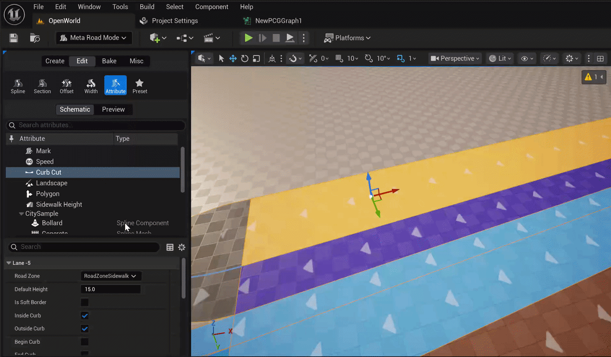
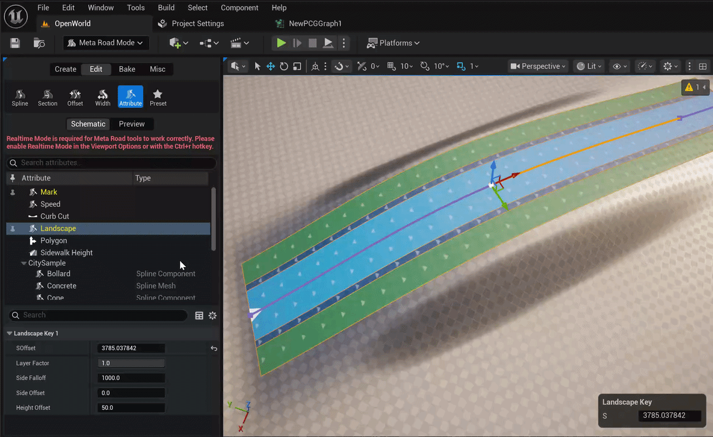
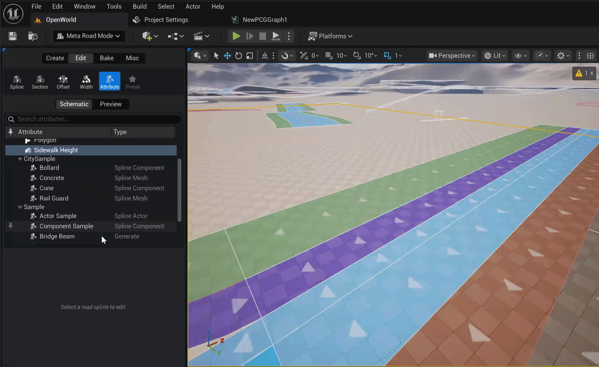
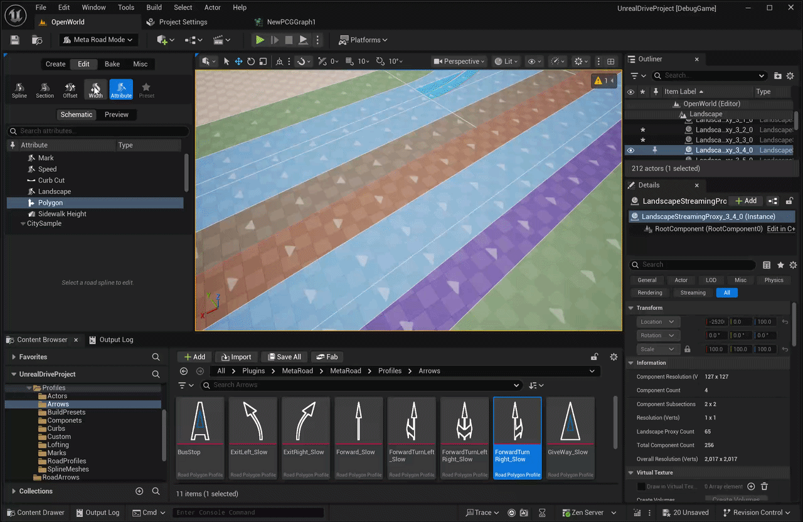

# Attribute Modes
These modes allow to add various **Road Attributes** to **Road Lane**, which can be used for procedural generation or any other purposes (see the [Road Attributes](RoadModel.md#lane-attributes) section):  
  

By default, two types of attributes are available: speed limit and road markings. 
To learn how to create new attribute types, see [Attribute Profile](Presets.md#attribute-profile).
To add a new attribute for a lane, select the appropriate mode in the **Road Editing Modes** menu, select the required **Road Lane**, and select **Create ATTRIBUTE_NAME** from the context menu. Then, add the required **Attribute Keys** from the same context menu:  
  

In the **Details Panel**, in the **Selection** group, you can edit the selected **Attribute Key**:  
  

## Road Mark Attribute
**Road Mark Attribute** is one of the [Road Attributes](RoadModel.md#lane-attributes) types that is available "out of the box" and allows you to add a **Mark** attribute to **Road Lane**, which is used in [Procedural Generation](ProcedureGenerationTool.md) to generate road markings. Each **Attribute Key** is assigned a road marking type, which can be selected in ```Profile```. Or you can create a new type on the spot (```Profile Source -> Use Custom```):  
  

If you need to remove markings for any of the sections on **Road Lane**, set ```Profile``` to ```empty```:  
  

To add new road marking profiles, see [Lane Mark Profiles](Presets.md#mark-profile).

## Curb Cut Attribute (Pro)
This attribute allows to create curb cuts on sidewalks:  
  

## Landscape Attribute (Pro)
The **Landscape Attribute** controls how the Unreal Engine landscape deforms along the road. Add it to the **center lane (lane index 0)** of a `URoadSplineComponent` that has a landscape assigned. Only one Landscape Attribute is allowed per lane section.
Keys use **cubic interpolation**, so height and falloff transition smoothly between keys.

| Property | Default | Description |
|----------|---------|-------------|
| `LayerFactor` | 1.0 | Landscape layer blend weight at this key [0–1] |
| `SideFalloff` | 1000 | Distance (in cm) over which the landscape modification fades out laterally |
| `SideOffset` | 0 | Lateral offset of the deformation zone from the reference line |
| `HeightOffset` | 50 | Z-height offset applied to landscape vertices under the road |

  

## Sidewalk Height Attribute 
The **Sidewalk Height Attribute** adjusts the Z-height of sidewalk mesh vertices at specific positions along the lane — for example, to create ramps or sloped curb approaches. It modifies existing mesh vertices; it does **not** add new geometry, so it works best when keys are not placed too close together.

Can only be added to **sidewalk lanes** (`FRoadZoneSidewalk` zone type).  
Keys use **cubic interpolation** for smooth height transitions.

| Property | Range | Description |
|----------|-------|-------------|
| `Height` | −100 to +100 cm | Z-offset applied to sidewalk vertices at this key position |

  

## Polygon Attribute (Pro)
The **Polygon Attribute** places custom 2D polygon shapes on a lane at specific arc-length positions. Each key references a [Polygon Profile](Presets.md#polygon-profile) asset that defines one or more closed polygon outlines. Use it for stop lines, arrow markings, hatching, or any custom surface overlay that doesn't fit the standard road marking system.

Keys use **stepped** evaluation — the last key at or before the current SOffset is active.

| Property | Description |
|----------|-------------|
| `Profile` | The [Polygon Profile](Presets.md#polygon-profile) asset containing the polygon shapes |
| `Alpha` | Lateral position [0.1–1.0] within the lane width where the polygon anchor is placed: 0.1 = inner edge, 0.5 = lane center, 1.0 = outer edge |

  


## Curve Attributes 
Curve Attributes are designed to generate any objects along road lanes, such as fences, barriers, trees, etc.
There are 4 main types of the Curve Attributes:  
  - Curve Attribute - a base type from which you can inherit in C++ or BP and write any logic for generating objects along the road lane.
  - Spline Mesh Attribute - designed to generate a USplineMeshComponent along a road lane
  - Component Template Attribute - designed to generate any USceneComponent along a road lane
  - Actor Template Attribute  - designed to generate any AActor along a road lane  
  
See [Curve Profiles](Presets.md#attribute-profile) for details.