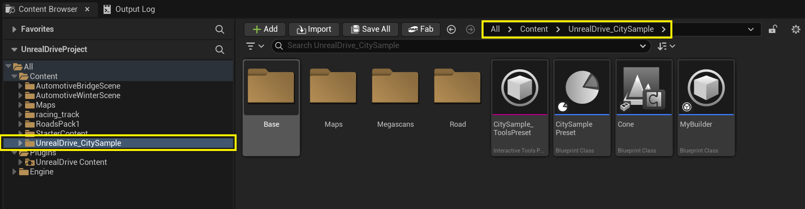
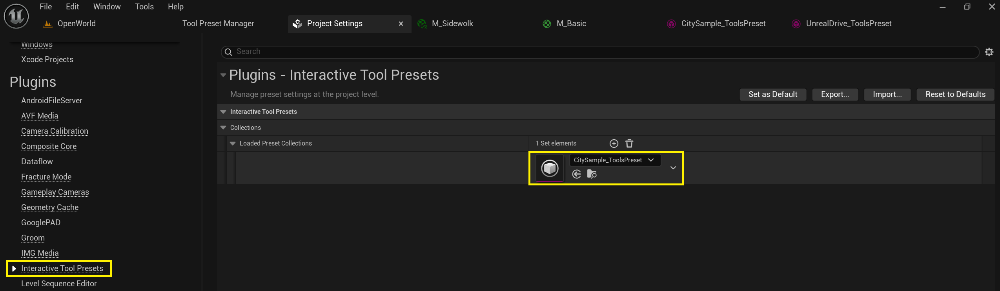
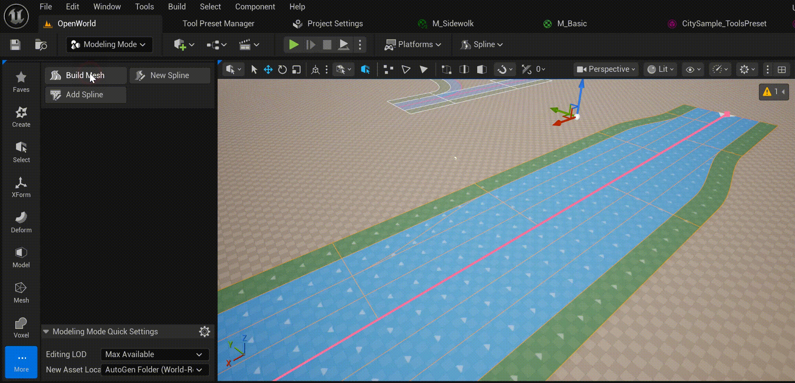
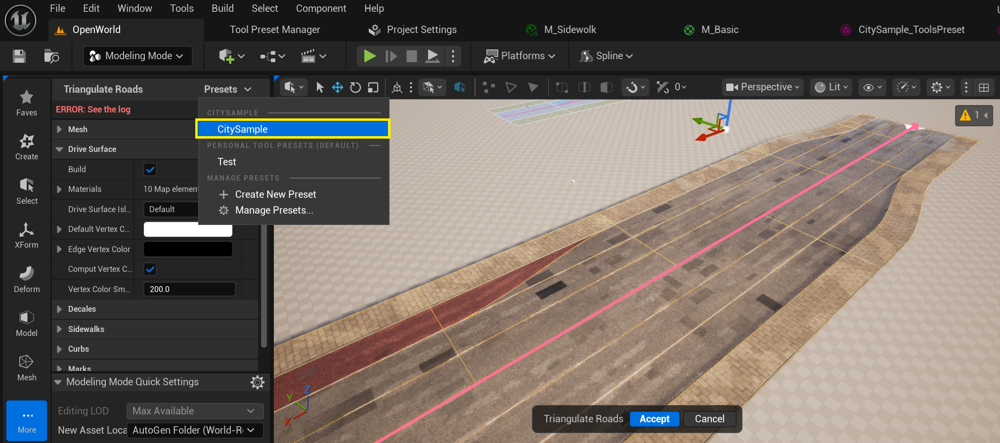
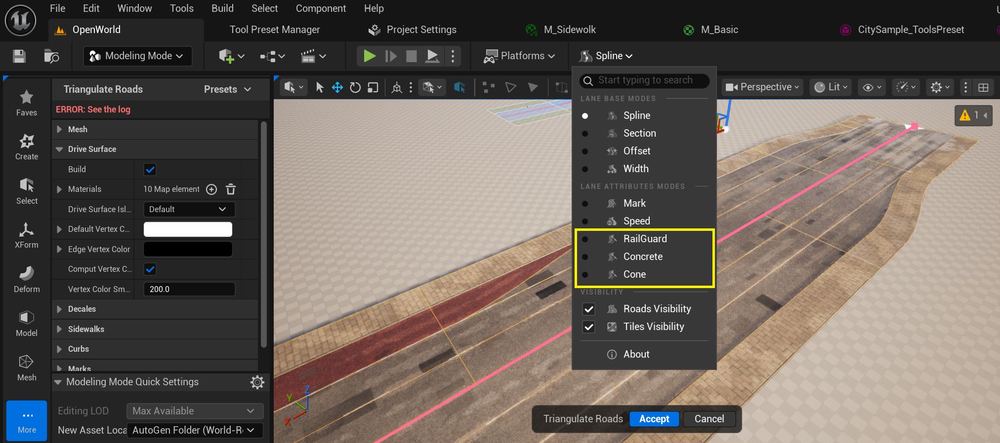

# City Sample Materials Pack

The plugin includes a simple, lightweight road materials pack by default. The all videos and images from this docs use the free CitySample material pack. This is a pack of materials from the [CitySample](https://www.fab.com/listings/4898e707-7855-404b-af0e-a505ee690e68) project adapted for the UnrealDrive plugin. 
If you wish, you can download and install it separately.
Steps:
  1. Download the CitySample materials pack from the [link](https://drive.google.com/file/d/1-vRnbm9osYMYmgqG-HwYOeWytDwnCWFY/view?usp=sharing) and unzip it into the **Content** folder of your UnrealEngine project. You should get the following project structure:   
      

  2. Add **CitySample_ToolsPreset** to the **Loaded Preset Collection** in the **Project Settings -> Plugins -> Interactive Tool Presets** menu:  
      
     You can also quickly access to the **Interactive Tool Presets** as follows:   
      

  3. After which the preset will become available in **CitySample**:  
      

  4. This pack also provides several **Lane Attributes** to enable the generation of additional SplineMeshes:
     
