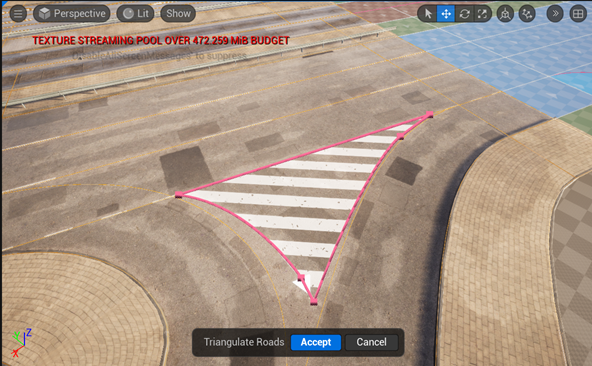
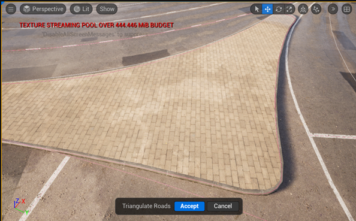
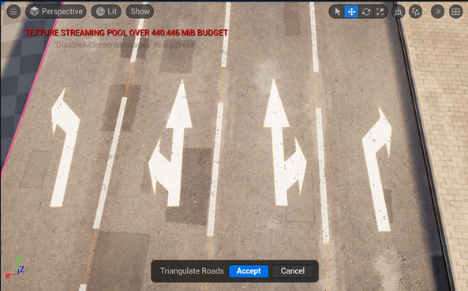
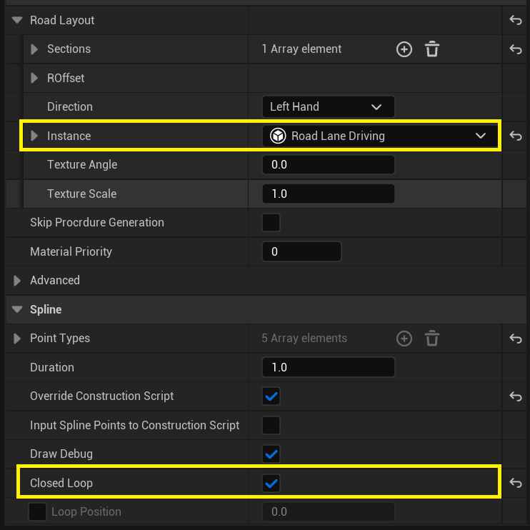
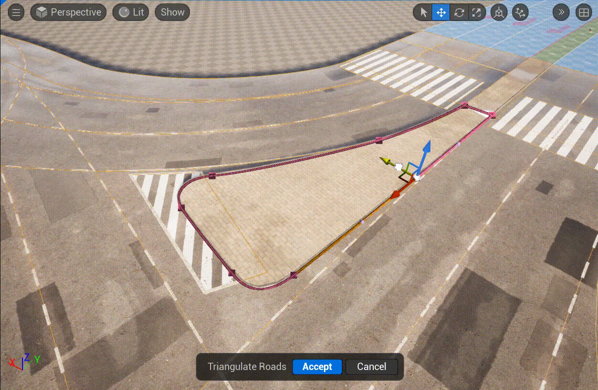
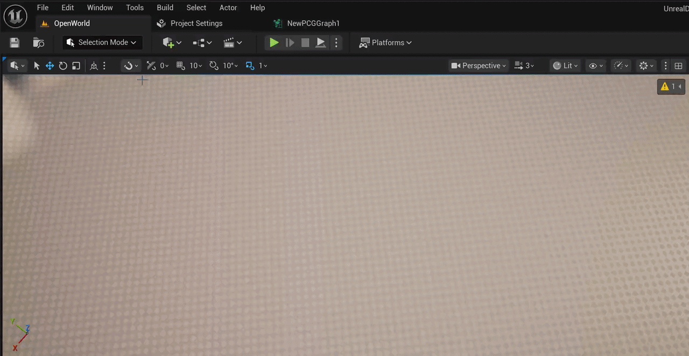
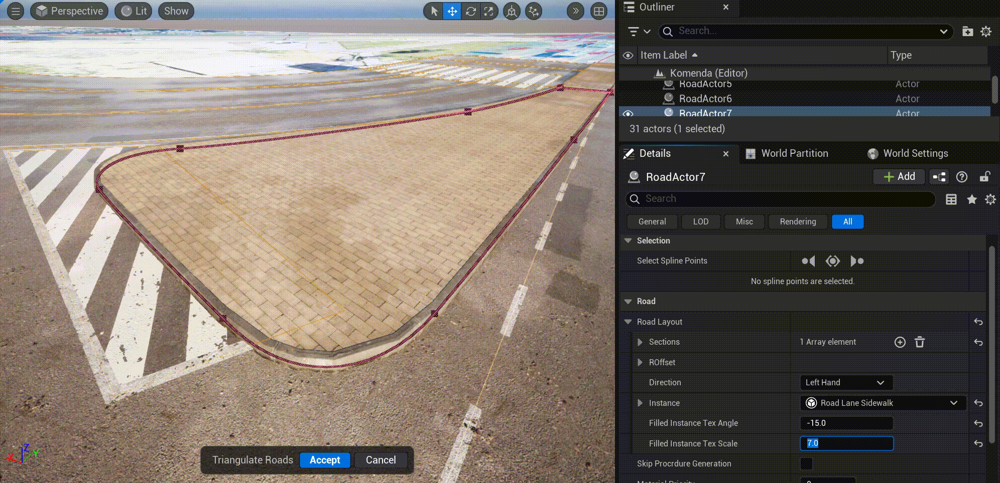

# Closed Loop Spline

The closed loop **URoadSplineComponent** allows to place various "islands" or extra road marks on roads, such as refuge islands, pedestrian crossings, or arrows:  
  

  

  

To start using **Closed Loop Spline**, just specify two parameters for **URoadSplineComponent** in the **Details Panel**:
  - Set **Spline -> Closed Loop** to ```true```
  - Set **Road -> RoadLayout -> Filled Instance** to ```Driving``` or ```Sidewalk```

  

After this, **URoadSplineComponent** turns into a familiar polygon drawing tool:  
  

In the [Draw Tool](DrawTool.md), you can immediately begin drawing the closed loop **URoadSplineComponent**. To do this, set the following parameters in the **Draw Tool** parameters:
  - Set **Road Spline -> Loop** to ```true```
  - Set **Road Spline -> Filled Instance** to ```Driving``` or ```Sidewalk```

  

In the **Details Panel** for **URoadSplineComponent** you can set the parameters for generating texture coordinates - angle and scale:
  

```{Important}
It's important that the drawn "islands" be located within the same Actor as the main road surface (another logically related **URoadSplineComponents**).
This will allow the procedural mesh of the entire road section to be correctly generated as a single unit.
```
