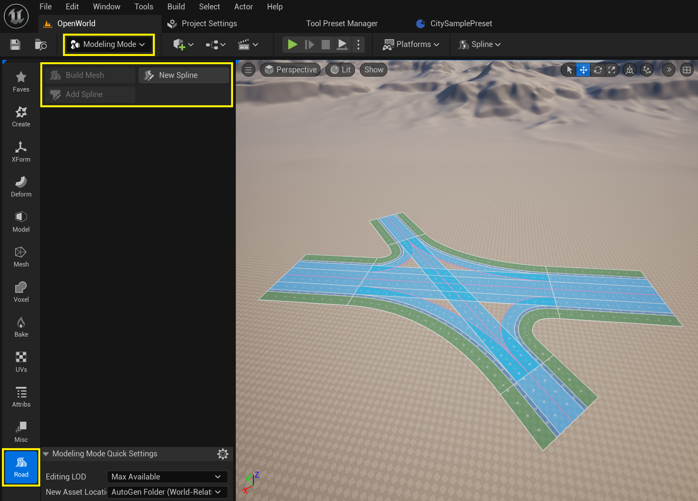

Create Tools
===================================

.. toctree::
   :numbered:
   :glob:
   :maxdepth: 2

   DrawSplineTool.md
   DrawCrosswalkTool.md
   ProcedureGenerationTool.md
   NewIntersectionTool.md

**Create Tools** are a set of tools in the MetaRoad editor mode for placing and generating road geometry: drawing new road splines, placing pedestrian crosswalks, generating 3D meshes, and creating intersections.

