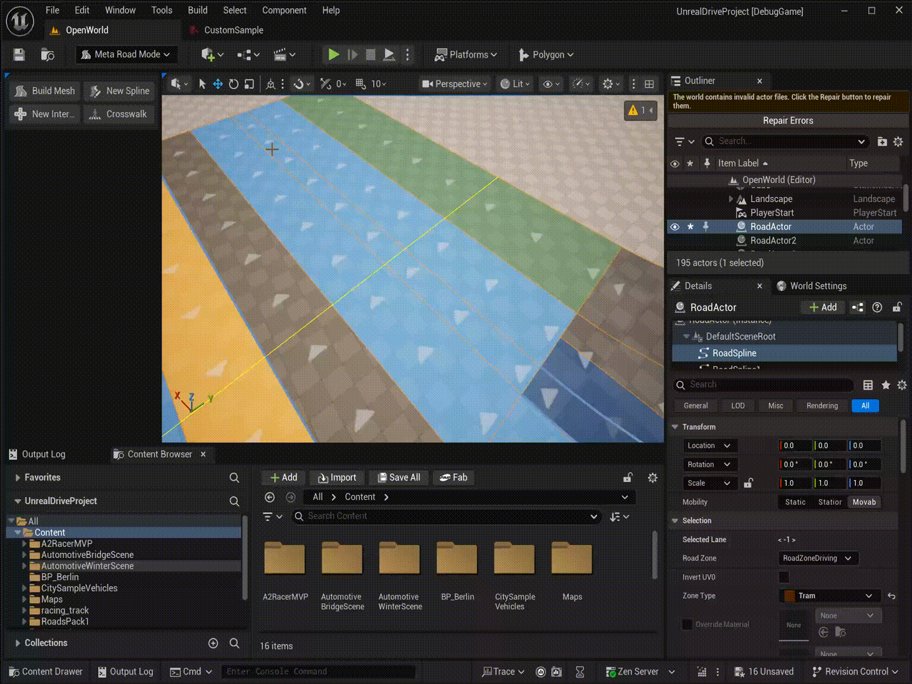

# Draw Crosswalk Tool

The **Draw Crosswalk Tool** lets you place pedestrian crosswalks on road actors with a single click-drag gesture. Each crosswalk is stored as a `UCrosswalkComponent` attached to the selected actor and participates in [procedural mesh generation](ProcedureGenerationTool.md) together with the road surface.

## Requirements

Exactly one actor containing at least one `URoadSplineComponent` must be selected before activating the tool.

## Drawing a Crosswalk

1. Select an actor that contains a `URoadSplineComponent`.
2. Activate **Draw Crosswalk Tool** from the MetaRoad toolbar.
3. **Press and hold LMB** at the start position of the crosswalk — the tool raycasts against world geometry (or falls back to Z=0 if nothing is hit).
4. **Drag** to set the length and direction — a live stripe preview updates in the viewport.
5. **Release LMB** to place the crosswalk. The tool stays active so you can place additional crosswalks without re-activating it.

After placement, select the `UCrosswalkComponent` in the **Details Panel** to edit its properties, or drag the start/end handles directly in the viewport.

## Properties

| Property | Description |
|----------|-------------|
| `StartWidth` | Crosswalk width at the start end |
| `EndWidth` | Crosswalk width at the finish end (linearly interpolated along the center line) |
| `StripeLength` | Length of each white stripe along the center line direction |
| `StripeInterval` | Gap between consecutive stripes |
| `Rotation` | Rotation of each stripe around its own center (clamped to ±45°) |
| `bRectangularStripes` | `true` — each stripe is a uniform-width rectangle; `false` — trapezoid (width interpolated at stripe edges) |
| `RoadZone` | Road surface type (material/color) applied to all generated stripe polygons |
| `TextureAngle` | UV texture rotation in degrees |
| `TextureScale` | UV texture scale multiplier |

  

