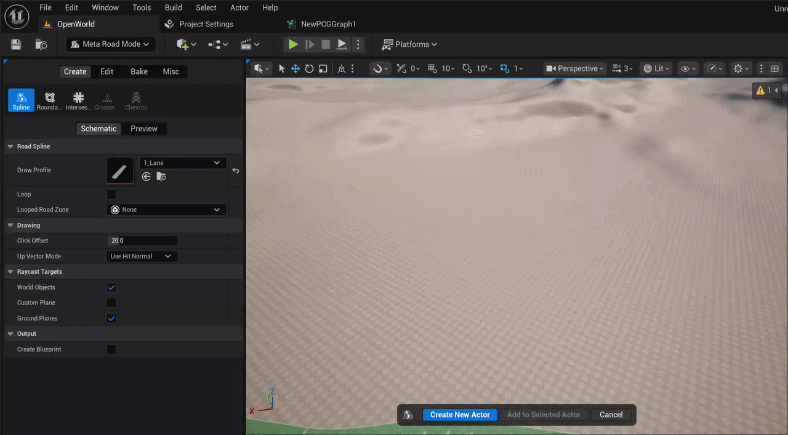
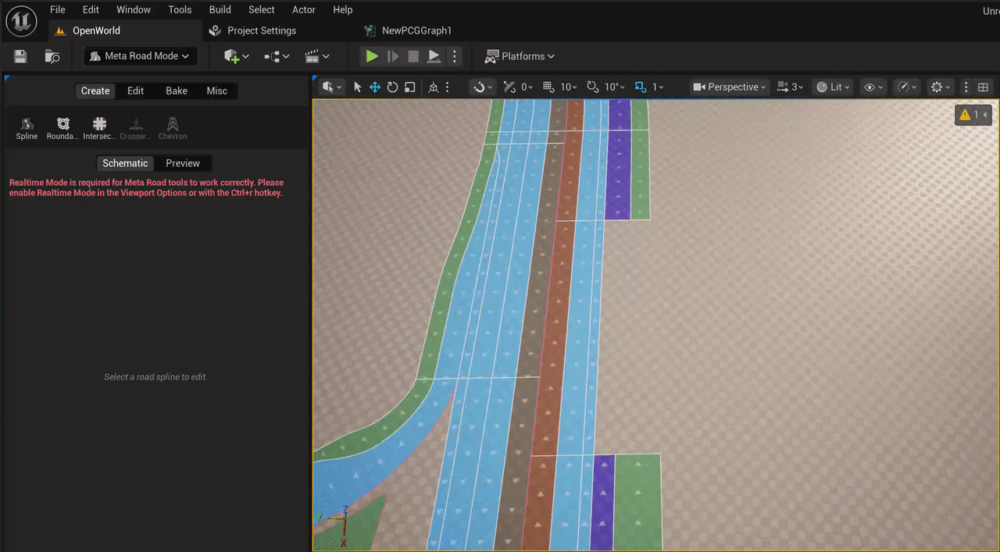
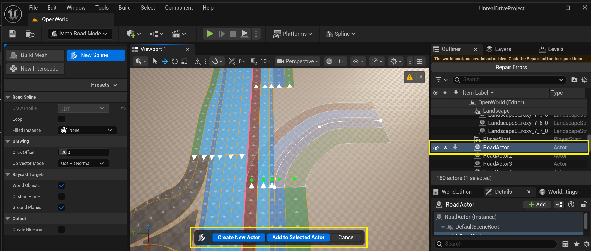
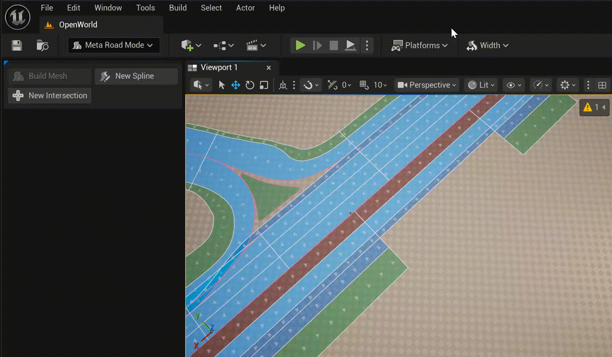

# Draw Spline Tool
**Draw Spline Tool** allow to "draw" **URoadSplineComponent** in the usual way, as in popular 2D vector editors. There are two drawing modes: 
  - Drawing from Profile
  - Drawing from **Lane Successor Connection**

The drawing mode is determined automatically based on where you start drawing the spline. If you start drawing the spline from a **Lane Successor Connection** mode **Drawing from Lane Successor Connection** will be selected, otherwise, mode **Drawing from Profile** will be selected.

## Drawing from Profile
If you start drawing a spline from any point other than the **Lane Successor Connection**, the **Drawing from Profile** mode will be selected. 
In this mode, you can select a profile from the **Draw Profile** drop-down menu:  
  
A new road profile can be added in [presets](Presets.md#road-lanes-profiles).  

## Drawing from Lane Successor Connection
If you start drawing a spline with the [Lane Successor Connection](RoadModel.md#intersections-and-junctions), the **Drawing Lane Successor Connection** mode will be selected. 
In this mode, profiles are not available, but you can specify the number of lanes on the left and right of the source road.
  

## Finishing Spline Drawing
Once you've finished drawing a spline, you have two ways to create it:
- Create a new actor and add a **URoadSplineComponent** to it.
- Add a **URoadSplineComponent** to a selected actor that already contains at least one **URoadSplineComponent**.

  
 

You can finish drawing a spline at the [Lane Predecessor Connection](RoadModel.md#intersections-and-junctions). In this case, the spline drawing will be completed and you will need to choose one of the possible options for creating the **URoadSplineComponent** or cancel:  
  

