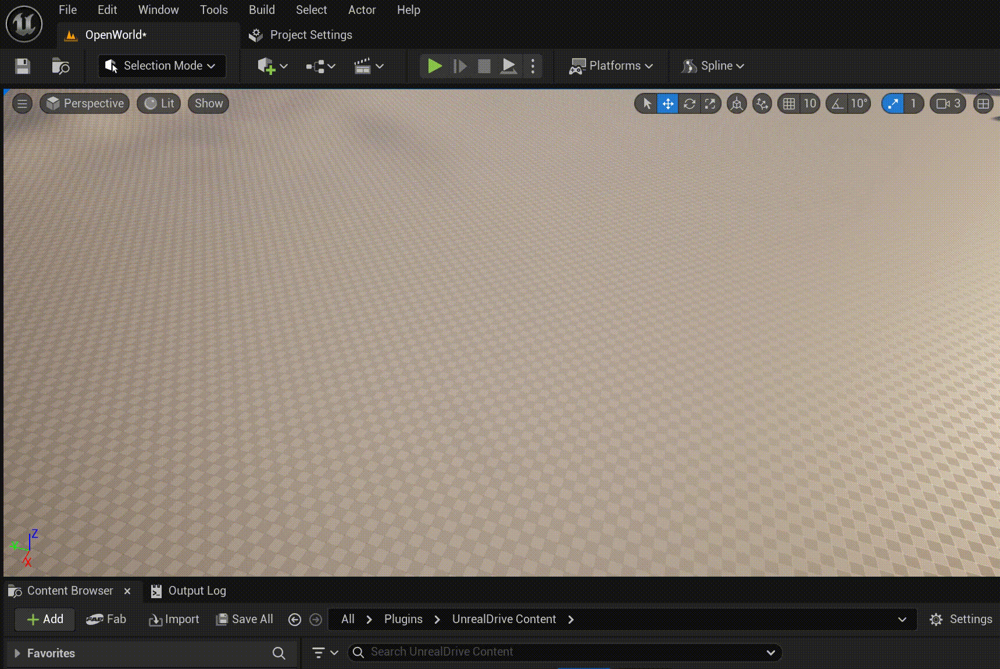
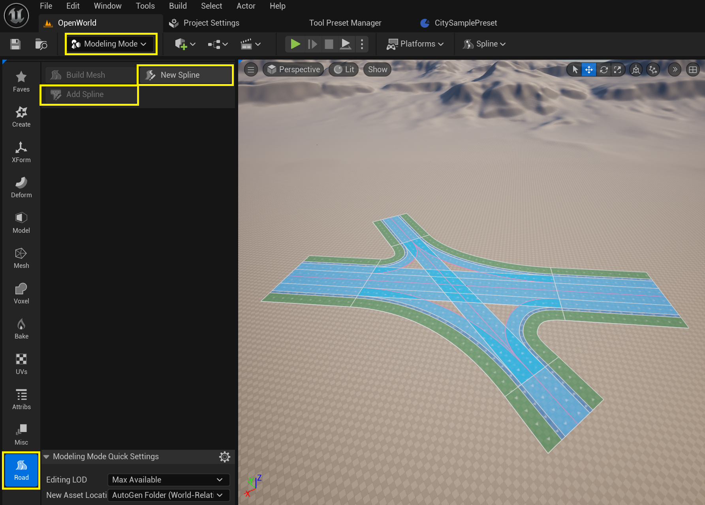
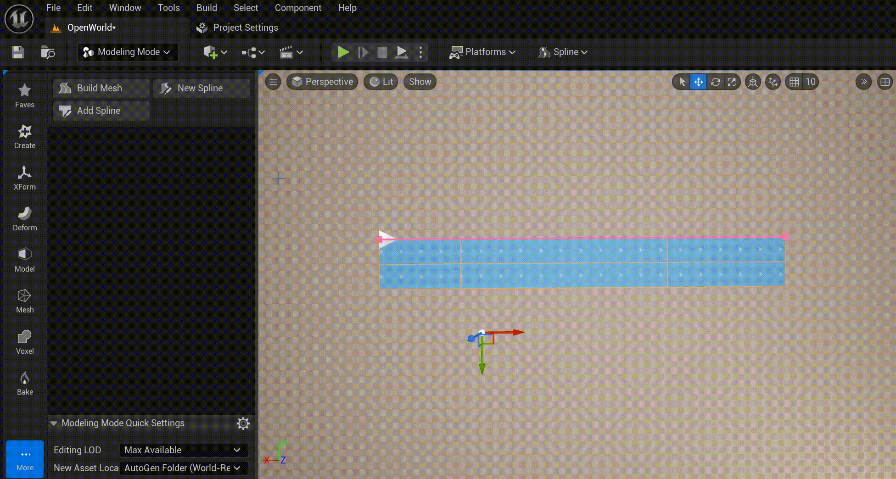
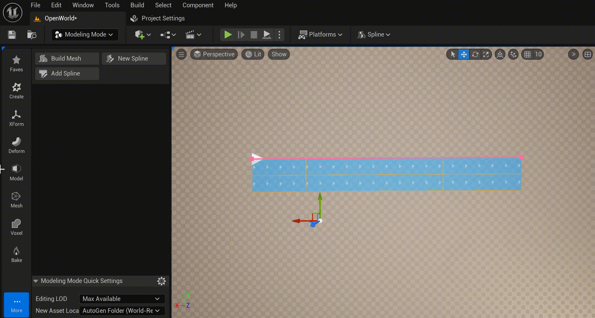
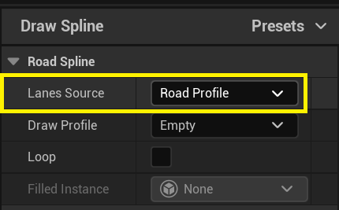
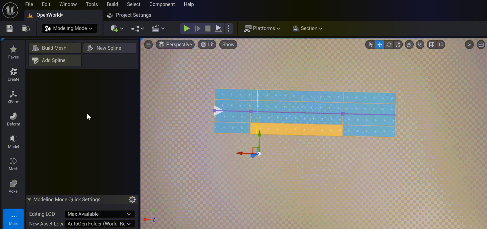
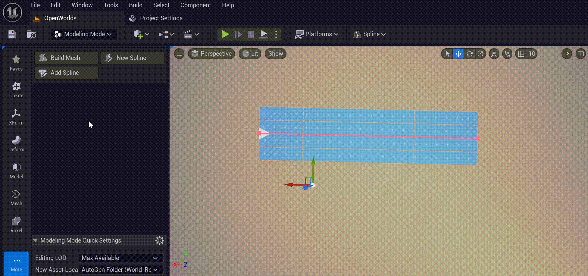

# Draw Modeling Tools
Есть два Modeling Tools - **New Spline** и **Add Spline**, которые позволяют "рисовать" **URoadSplineComponent** привычным образом так, как это происходит в популярных 2D векторных редакторах:  
  

Для доступа к этим tools, необходимо переключить **Editor Mode** в режим **Modeling Mode** и выбрать **Road** toolset:  
  

Эти два режима идентичны, отличаются лишь необходимостью создания нового AActor:
  - **New Spline** - создаст новый AActor и добавит к нему новый **URoadSplineComponent**.
  - **Add Spline** - добавит новый **URoadSplineComponent** к выделенному актору, который уже имеет как минимум один **URoadSplineComponent**.

Начать рисование сплайна можно с *Lane Successor Connection*:  
  

А закончить на *Lane Predecessor Connection*:  
  

## Lane Source
The **Lane Source** defines the rules for detection of road lanes profile (num and types of the road lanes) for spline drawing.  
  

There are next options:
  - **One Lane** - Copy only one road lane from the *Lane Successor Connection*. Only valid if the spline is drawn from the *Lane Successor Connection*.
      

  - **Right Side** - Copy the road lanes from the *Lane Successor Connection* to the last right lane in the source road section. Only valid if the spline is drawn from  the *Lane Successor Connection*.
      

  - **Both Sides** -  Copy all road lanes from the *Lane Successor Connection*. Only valid if the spline is drawn from  the *Lane Successor Connection*. 
      

  - **Road Profile** - Copy road lanes from the profile. Как добавить новый профайл - смотри [Road Lane Profiles](Presets.md#road-lanes-profiles)
      
