# Spline Editor Modes
Spline Editor Modes это режимы редакториования **URoadSplineComponent**. Каждый из режимов предоставлят доступ к редактированиях соответсвующих свойств из [Road Model](RoadModel.md).
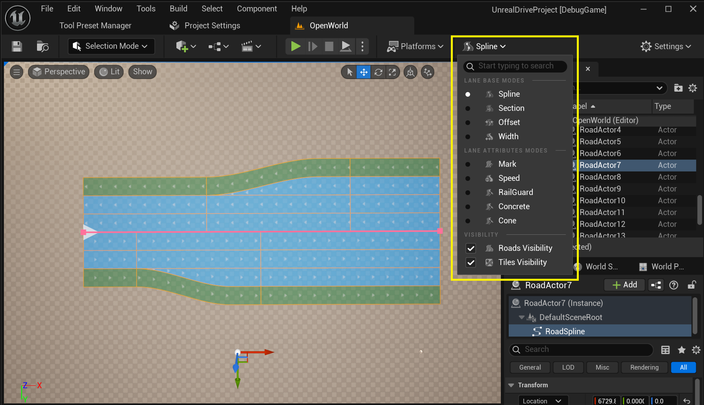.  
Есть **базовые** и **atttributes** режими.

## Spline Mode
Этот режим позволяет взаимодествовать с **URoadSplineComponent** как с обычным сплайном UnrealEnguine - создавать и удалять узлы, редактиров тангенты.  
Сплайн всегда имеет розовый цвет.  
Согласно Road Model, **Spline Mode** это режим редактирования [Road Reference Line](RoadModel.md#road-reference-line).  
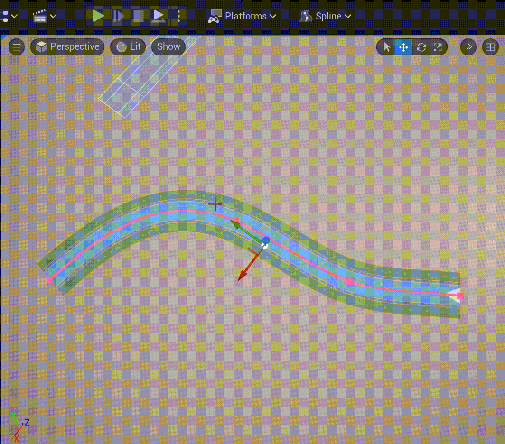  
Из дополнительных функций сплайна, который нет в оригенальномй USplineComponent - была добавлена возможность назначить тип узла - **Arc**:  
  
Так же в этом режиме можно управлять соеденениями сплайнов (смотри [Intersections and Junctions](RoadModel.md#intersections-and-junctions)):  
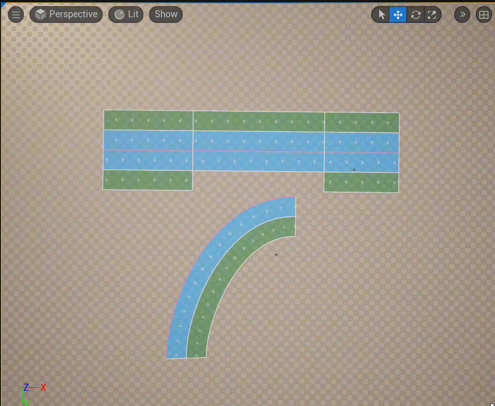  
В **Details Panel** в группе **Selection** доступна возможность редактировать выделенного узел сплайна:  
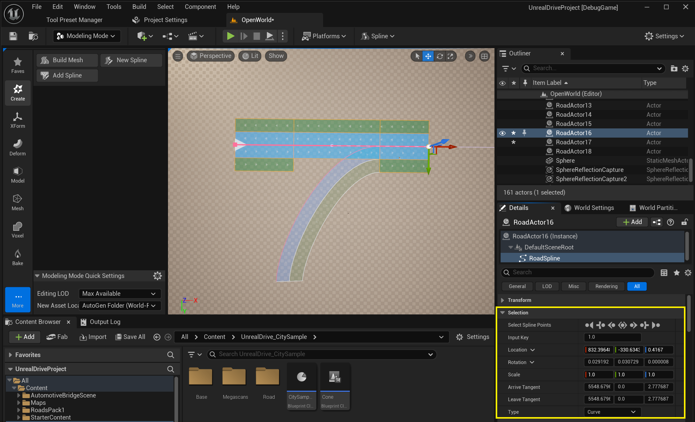  

## Section Mode
Этот режим позволят редактировать [Road Lanes](RoadModel.md#road-lanes) и [Lane Sections](RoadModel.md#lane-sections) описанные в [Road Model](RoadModel.md).  
Центральная сиреневая линия - это [Center Lane](RoadModel.md#road-lanes) и на най распологаются узлы, за который можно тянуть и изменетья длинну секции:  
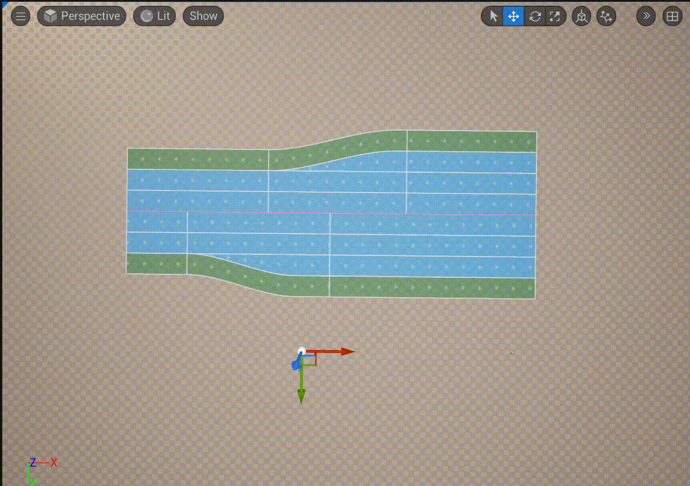  
Через контекстное меню можно добавлять и удалять секции:  
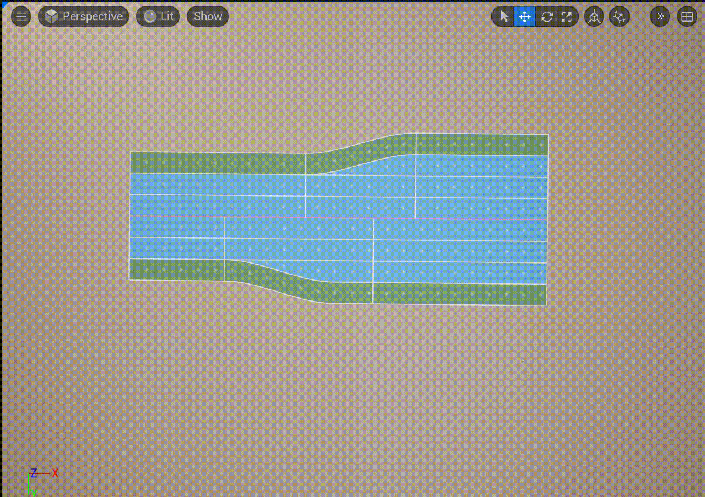  
И добавлять и удалять **Road Lanes**:  
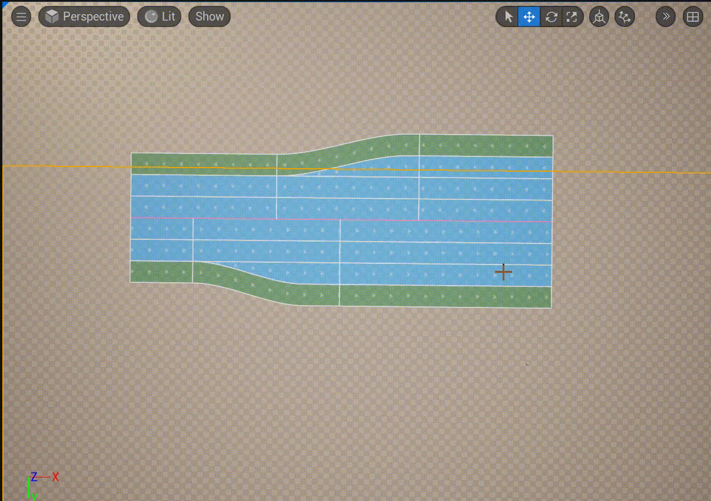  
В **Details Panel** в группе **Selection** доступна возможность редактировать выделенной **Road Section**:  
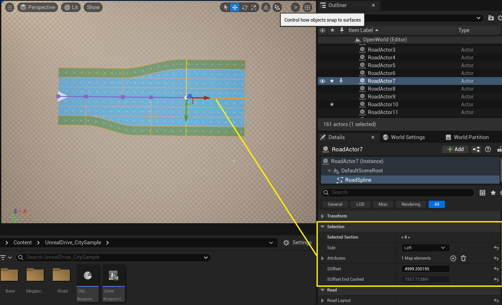  
Так же в **Details Panel** в группе **Selection** доступна возможность редактировать выделенной **Road Lane**:  
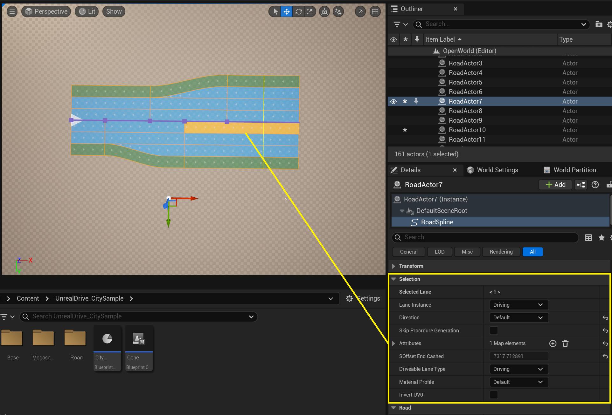  

## Offset Mode
Этот режим позволят задавать смещения **Center Lane** относительно [Road Reference Line](RoadModel.md#road-reference-line) и соответсвует [Lane Offset](RoadModel.md#lane-offset) описанный в [Road Model](RoadModel.md).  
В некоторых случаях смещение **Center Lane** может быть удобным, когда менятся кол-во полос с лева и справа.  
Редактирование ширины **Road Offset** по своей природе похоже на редактирвоание сплайна - можно задавть произвольное форму сплайна, добавлять/удалять узлы, редактировать тангенты:
  
В **Details Panel** в группе **Selection** доступна возможность редактировать выделенной **Offset Key**:  
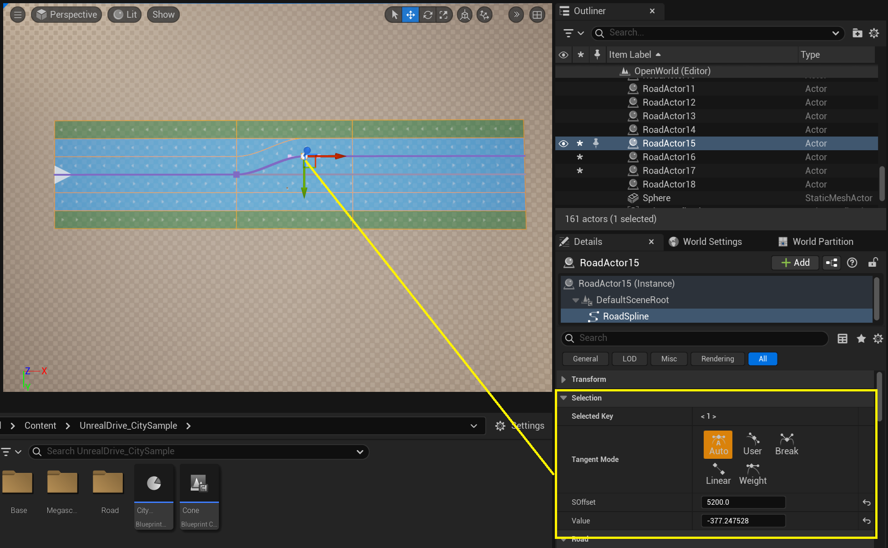  

## Width Mode
Этот режим позволят редактировать ширину **Road Lane**.  
Редактирование ширины **Road Lane** по своей природе похоже на редактирвоание сплайна - можно задавть произвольное форму сплайна, добавлять/удалять узлы, редактировать тангенты:
  
В **Details Panel** в группе **Selection** доступна возможность редактировать выделенной **Width Key**:  
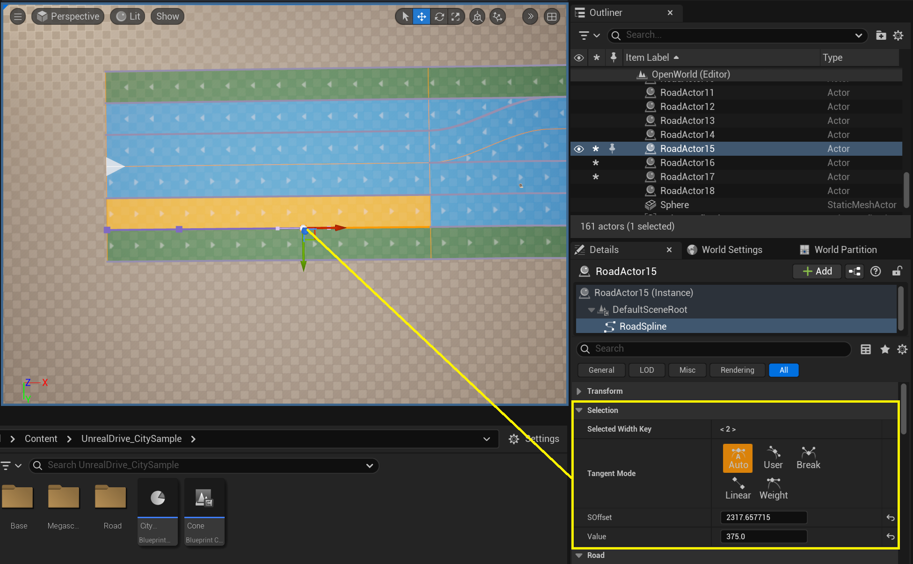  

## Attribute Modes
Эти режимы позволяют добавлять к **Road Lane** различные аттрибуты, который могут использоваться для процедурной генерации или произвольных целей. Смотри раздел [Road Attributes](RoadAttributes.md)