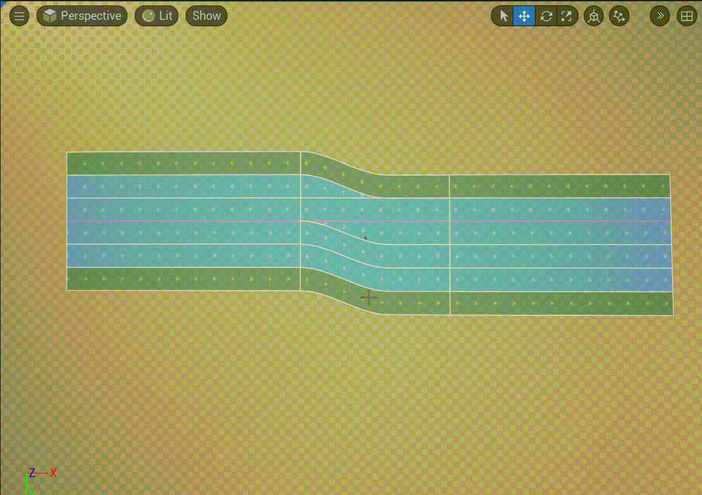

# Road Editor Modes
Spline Editor Modes это режимы редакториования **URoadSplineComponent**. Каждый из режимов предоставлят доступ к редактированиях соответсвующих свойств, описанных в [Road Model](RoadModel.md).
.  
Есть **базовые** и **attributes** режими.

## Spline Mode
Этот режим позволяет взаимодествовать с **URoadSplineComponent** как с обычным сплайном UnrealEnguine - создавать и удалять узлы, редактиров тангенты. Сплайн всегда имеет розовый цвет.  
Согласно Road Model, **Spline Mode** это режим редактирования [Road Reference Line](RoadModel.md#road-reference-line).  
  
Из дополнительных функций редактирования сплайна - была добавлена возможность назначить тип узла - **Arc**:  
  
Так же в этом режиме можно управлять соеденениями сплайнов (смотри [Intersections and Junctions](RoadModel.md#intersections-and-junctions)):  
  
В **Details Panel** в группе **Selection** доступна возможность редактировать выделенного узел сплайна:  
  

## Section Mode
Этот режим позволят редактировать [Road Lanes](RoadModel.md#road-lanes) и [Lane Sections](RoadModel.md#lane-sections) описанные в [Road Model](RoadModel.md).  
Центральная сиреневая линия - это [Center Lane](RoadModel.md#road-lanes) и на най распологаются узлы, за который можно тянуть и изменетья длинну секции:  
  
Через контекстное меню можно добавлять и удалять секции:  
  
И добавлять и удалять **Road Lanes**:  
  
В **Details Panel** в группе **Selection** доступна возможность редактировать выделенной **Road Section**:  
  
Так же в **Details Panel** в группе **Selection** доступна возможность редактировать выделенной **Road Lane**:  
  

## Offset Mode
Этот режим позволят задавать смещения **Center Lane** относительно [Road Reference Line](RoadModel.md#road-reference-line) и соответсвует [Lane Offset](RoadModel.md#lane-offset) описанный в [Road Model](RoadModel.md).  
В некоторых случаях смещение **Center Lane** может быть удобным, когда менятся кол-во полос с лева и справа.  
Редактирование ширины **Road Offset** по своей природе похоже на редактирвоание сплайна - можно задавть произвольное форму сплайна, добавлять/удалять узлы, редактировать тангенты:
  
В **Details Panel** в группе **Selection** доступна возможность редактировать выделенной **Offset Key**:  
  

## Width Mode
Этот режим позволят редактировать ширину **Road Lane**.  
Редактирование ширины **Road Lane** по своей природе похоже на редактирвоание сплайна - можно задавть произвольное форму сплайна, добавлять/удалять узлы, редактировать тангенты:
  
В **Details Panel** в группе **Selection** доступна возможность редактировать выделенной **Width Key**:  
  

## Attribute Modes
Эти режимы позволяют добавлять к **Road Lane** различные **Road Attributes**, который могут использоваться для процедурной генерации или любых других целей, cмотри раздел [Road Attributes](RoadModel.md#lane-attributes).  
  
По умолчанию, доступо два типа атрибутов - speed limit и дорожныая разметка. 
Как создавать новый аттрибуты смотри [Road Attribute Entries](Presets.md#road-attribute-entries).  
Чтобы добавить для полосы новый аттрибут небходимо выбрать соотвествующий режим, в меню **Road Editor Modes**, выделить необходимую **Road Lane** и контестом меню выбрать пункт **Create ATTRIBUTE_NAME**. После чего, из того же контестного меню добавить необходимое **Attribute Keys**:  
  
И в **Details Panel** в группе **Selection** доступна возможность редактировать выделенный **Attribute Key**:  
  

## Road Mark Attribute
Как следует из названия раздела **Road Mark Attribute** - это один из типов [Road Attributes](RoadModel.md#lane-attributes), который доступен "из коробки" и позволят добалять в **Road Lane** атрибут типа **Mark**, который используется в [процедурной генрации](ProcedureGenerationTool.md) для генерации дорожной разметки. За каждым **Attribute Key** закрепляется типа дорожной разметки, который можно выбрать из присета (```Profile Name```) или создать новый тип на месте (```Profile Name -> Use Custom```):  
  
Если для какого-то из участков на **Road Lane** необходмо убрать разметку, то ```Profile Name``` у устанавливается в ```None```:
  
Для добавления/удаления профайлов дорожной разметки, смотри [Road Attributes](Presets.md#lane-mark-profiles).