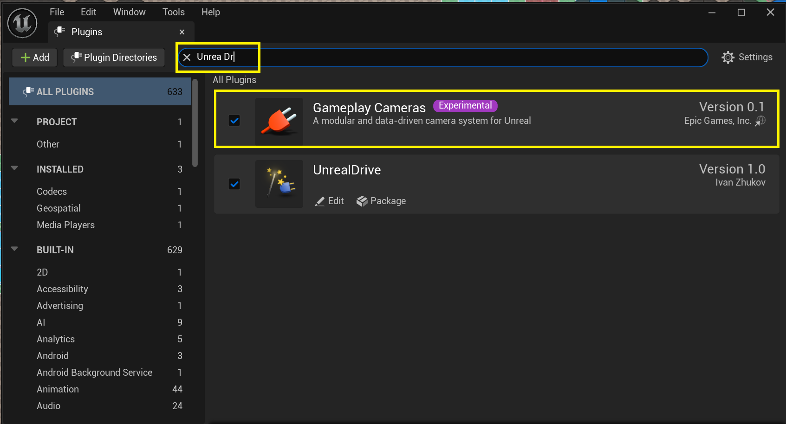
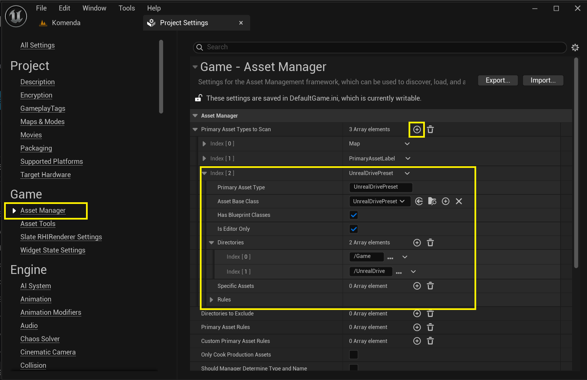

# Installation

UnrealDrive это плагин для UnrealEngine (cм. [Working with Plugins in UnrealEngine](https://dev.epicgames.com/documentation/en-us/unreal-engine/working-with-plugins-in-unreal-engine)), поэтому его установки ни чем не отличается от установки любого плагина UnrealEngine:
  1. Скопировать папку плагина UnrealDrive в папку **Plugins** в нутри вашего проекта UnrealEngine (рядом с файлом .uproject) или в папку **Engine\Plugins** вашего установленного UnrealDrive. Если вы купили и установили плагин через площадку [fab.com](https://www.fab.com/), то он уже будет скопирован в папку **Engine\Plugins\Marketplace**
  2. From the main menu, go to **Edit -> Plugins**. This opens the **Plugins** window and enable the **UnrealDrive** plugin
    
  3. From the main menu, go to **Edit -> Project Settings**. Navigate to the **Asset Manager** and add a new item to the **Primary Assets to Scan** with next options:  
       
     - Enter the value **UnrealDrivePreset** in the **Primary Assets Type** field
     - Сhoose the **UnrealDrivePreset** in the **Primary Base Class** field
     - Set the **Has Blueprint Classes** field
     - Set the **Is Editor Only** field
     - Add **/Game** and **/UnrealDrive**  values to the **Directories** field