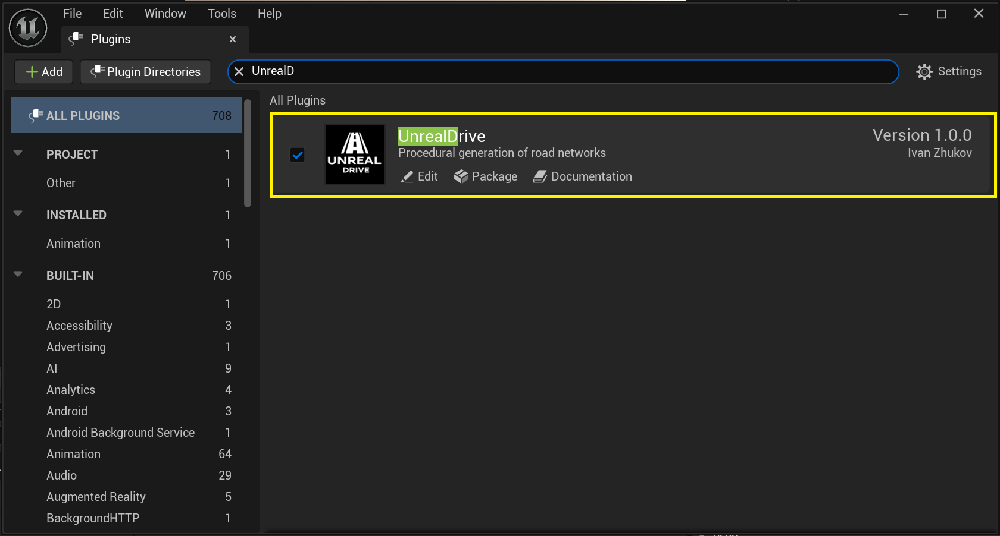
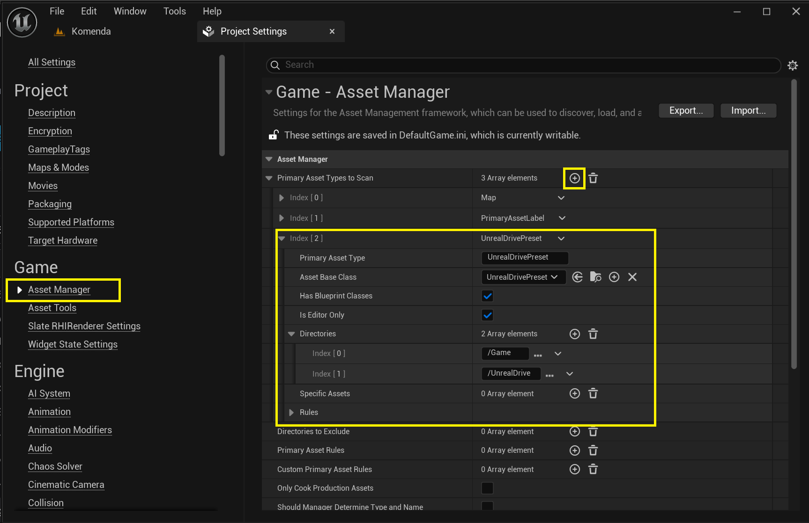

# Installation

UnrealDrive is a plugin for UnrealEngine, so the installation procedure for UnrealDrive is the same as for a regular UnrealEngine plugin (see [Working with Plugins in UnrealEngine](https://dev.epicgames.com/documentation/en-us/unreal-engine/working-with-plugins-in-unreal-engine)):  
  1. Copy the UnrealDrive **Plugins** folder to the Plugins folder of your UnrealEngine project (next to the .uproject file) or to the **Engine\Plugins** folder of the engine. If you purchased and installed the plugin through [fab.com](https://www.fab.com/), it will already be copied to the **Engine\Plugins\Marketplace** folder.  
  2. From the main menu, go to **Edit -> Plugins**. This opens the **Plugins** window and enables the **UnrealDrive** plugin:  
    
  3. Add [Unreal Drive Preset](Presets.md) to [Primary Assets to Scan](https://dev.epicgames.com/documentation/en-us/unreal-engine/asset-management-in-unreal-engine). This is necessary for the engine to detect all [Preset](Presets.md) in the project. To do this, from the main menu, go to **Edit -> Project Settings**. Navigate to the **Asset Manager** and add a new item to the **Primary Assets to Scan** with the following options: 
     - Enter the value **UnrealDrivePreset** in the **Primary Assets Type** field
     - Choose the **UnrealDrivePreset** in the **Primary Base Class** field
     - Set the **Has Blueprint Classes** field
     - Set the **Is Editor Only** field
     - Add **/Game** and **/UnrealDrive**  values to the **Directories** field  
     
       
