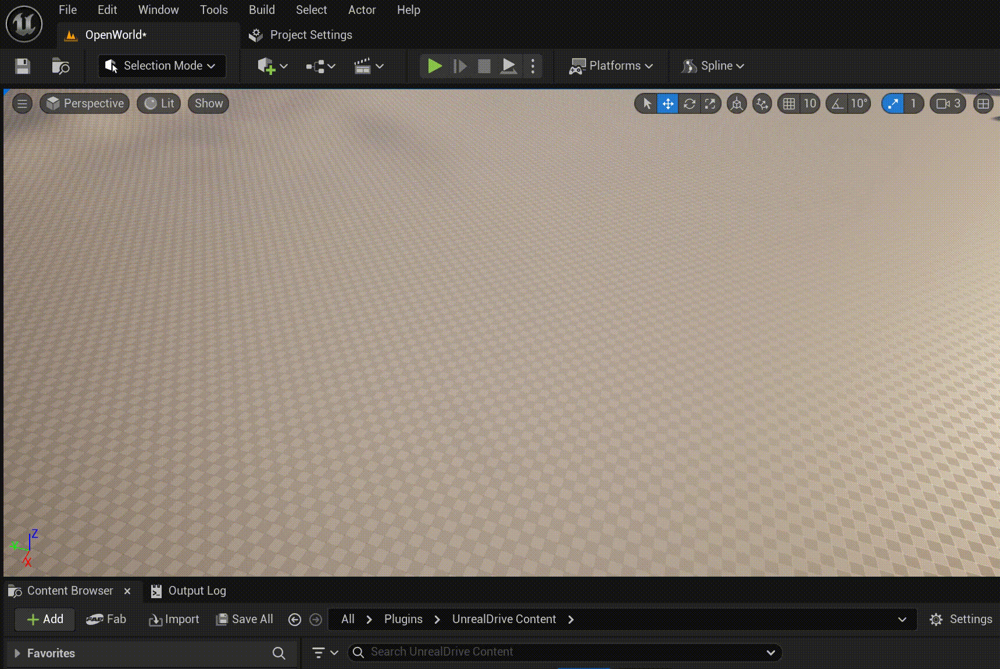
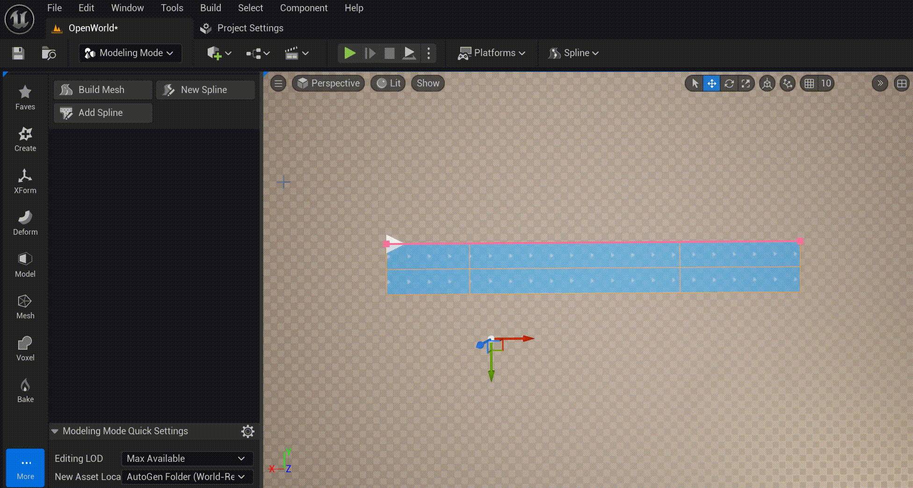
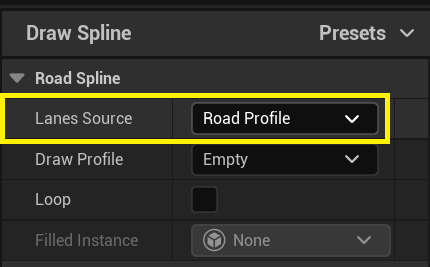
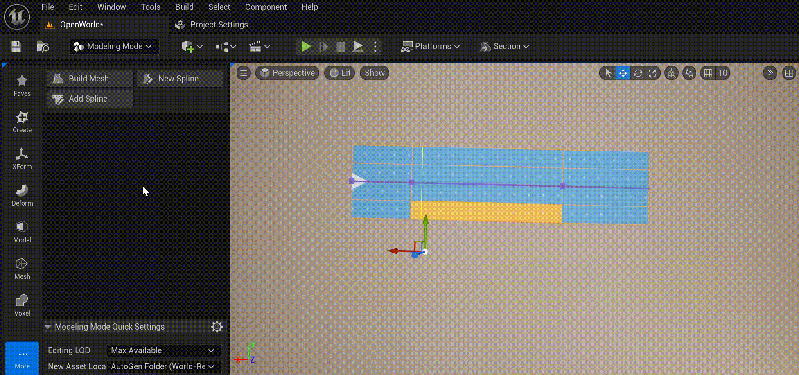
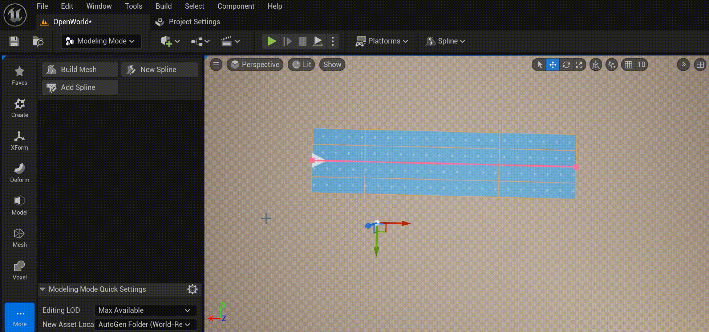

# New & Add Spline Modeling Tools
Для более удобного рисования сплайнов URoadSplineComponent разработано два Modeling Tools: **New Spline** и **Add Spline**. Эти два режима абсолютно одинаковые, отличнаются лишь тем, что в первлм случаем создает  новый AActor и к нему добавлятся новый URoadSplineComponent, во стором случаем добавляется новый URoadSplineComponent к выделленому актору, который уже имеет как минимум один URoadSplineComponent (т.е. для второго случая актор со спланами должен быть выделен).
  

Начать рисование сплайна можно с *Lane Successor Connection*:  
  

А закончить на *Lane Predecessor Connection*:  
  

## Lane Source
The **Lanes Sorce** defines the rules for detection of road lanes profile (num and types of the road lanes) for spline drawing.  
  
There are next options:
  - **One Lane** - Copy only one road lane from the *Lane Successor Connection*. Only valid if the spline is drawn from the *Lane Successor Connection*.
      
	- **Right Side** - Copy the road lanes from the *Lane Successor Connection* to the last right lane in the source road section. Only valid if the spline is drawn from  the *Lane Successor Connection*.
      
	- **Both Sides** -  Copy all road lanes from the *Lane Successor Connection*. Only valid if the spline is drawn from  the *Lane Successor Connection*. 
      
	- **Road Profile** - Copy road lanes from the profile.
      
