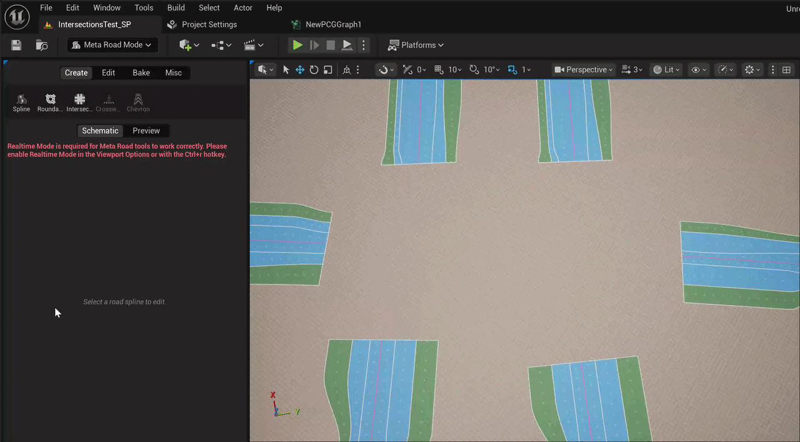
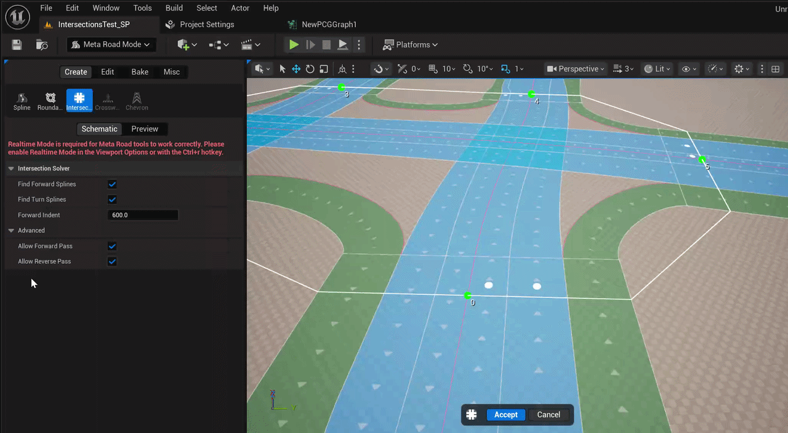

# New Intersection Tool (Pro)
This tool automates the creation of most types of standard intersections. You can still create any intersections and interchanges using the [Draw Spline Tool](DrawSplineTool.md). This tool's purpose is to speed up the creation process. For particularly complex and non-standard intersections, you may have to create them entirely manually using the [Draw Spline Tool](DrawSplineTool.md).   

To start generating an intersection, simply switch to the **New Intersection Tool** mode and start selecting the beginnings or ends of the **URoadSplineComponents** for which you want to create an intersection:  
  

For each lane entering the intersection, you can set the possible directions of traffic movement:  
  
