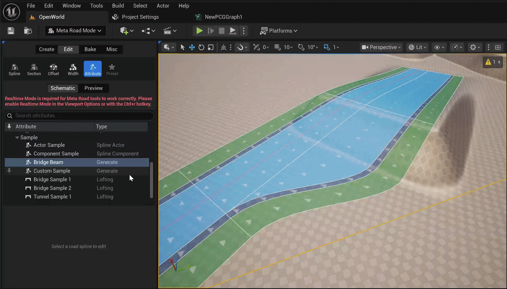
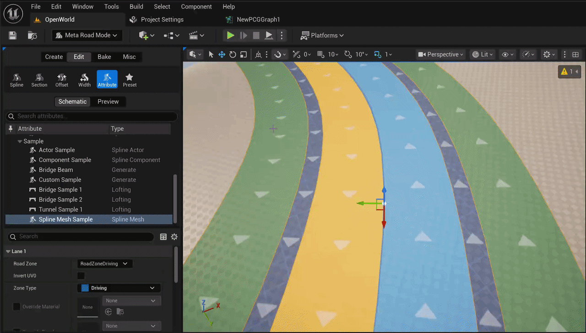
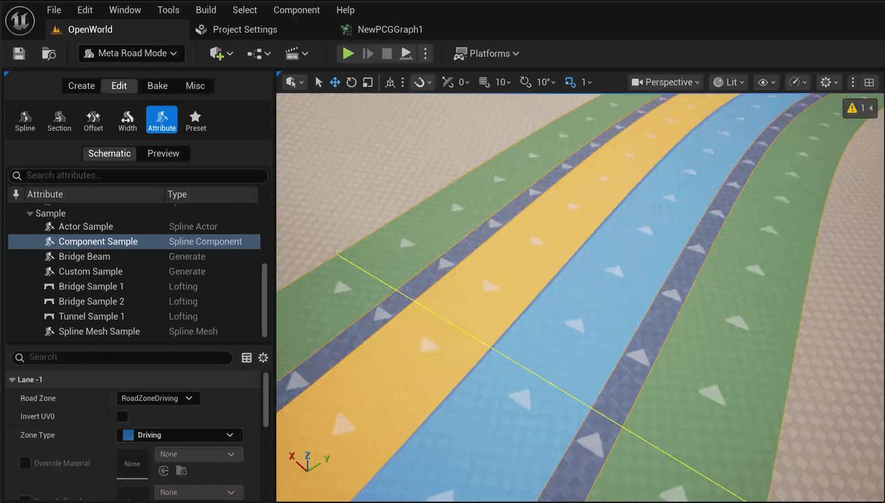
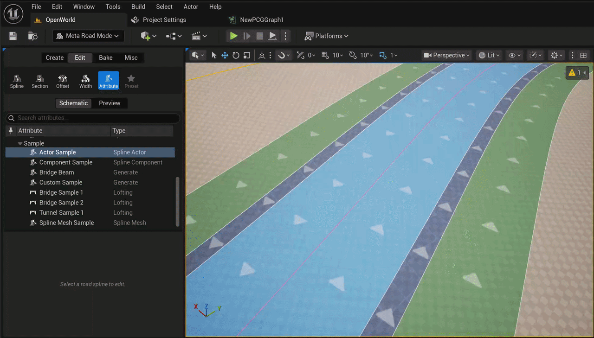
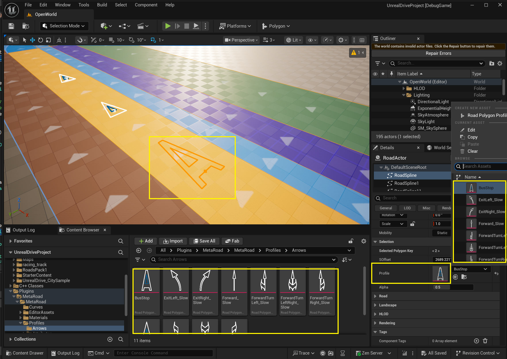
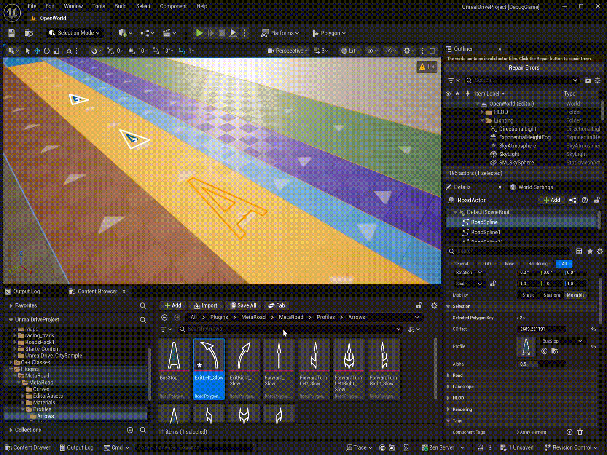

# Profiles
MetaRoad offers the ability to create various "presets" of road elements.  
Each "preset" is an UnrealEngine asset that you can add in the **Content Browser** window under the **Meta Road** category:  
  

The MetaRoad already has a default presets at **/MetaRoad/DefaultPreset**. It should not be changed for backward compatibility:  
  

## Road Profile
Contains road drawing profile using in [Draw Spline Tool](DrawSplineTool.md#lane-source):  
  

## Curb Profile
Contains curb type profiles for **Road Lane** type **RoadLaneSidewalk**. You can set the curb material and geometry. These profiles are available in [Build Mesh Modeling Tool](ProcedureGenerationTool.md):  


## Mark Profile
Contains profiles of road marking types for **Road Lane** type **RoadLaneDriving**. You can specify the type (solid, dashed, double), dimensions, and color of the marking strip. These profiles are available in [Road Mark Attribute](AttributeModes.md#road-mark-attribute):   
  

## Attribute Profile
Allows to create custom [Lane Attribute](RoadModel.md#lane-attributes). All new attributes are automatically available in [Attribute Mode](AttributeModes.md):  
   
After selecting the option to create an **Attribute Profile**, you will be asked to select the base class of the **Attribute Profile**.  
  

**Attributes** can store any data and perform any actions along road lanes. Below is a group of Curve attributes (URoadLaneAttributeCurve) that can be used to generate various objects along road lanes.

### Curve
This is the base class (URoadLaneAttributeCurve) allows to generate objects along a road lane. It doesn't generate anything itself, but provides the **GenerateAssert()** method, which must be overridden in BP or C++:  
  
Example of such an asset at: */MetaRoad/MetaRoad/Profiles/Attributes/CustomSample*.  
  

### Spline Mesh
Allows to generate **USplineMeshComponent** from ```Static Mesh``` along **Road Lane** at ```LengthOfSegment``` interval. 
  
Example of such an asset at: */MetaRoad/MetaRoad/Profiles/Attributes/SplineMeshSample*.
  

### Component Template
Allows to generate arbitrary **USceneComponent** from ```Component Template``` along **Road Lane** at ```LengthOfSegment``` interval. 
  
Example of such an asset at: */MetaRoad/MetaRoad/Profiles/Attributes/ComponentSample*.  
This template is convenient to use for repeating objects along **Road Lane**, such as traffic cones, flagpoles, lampposts, and power lines.
  

### Actor Template
Allows to generate arbitrary ```Actor``` along **Road Lane** at ```LengthOfSegment``` interval. 
  
Example of such an asset at: */MetaRoad/MetaRoad/Profiles/Attributes/ActorSample*.
  

## Polygon Profile (Pro)
A **Polygon Profile** (`URoadPolygonProfile`) is a reusable asset that stores one or more 2D closed polygon shapes. These shapes are used by the [Polygon Attribute](AttributeModes.md#polygon-attribute) to place custom overlays (stop lines, arrows, hatching, etc.) on road lanes.
  
Each profile contains an array of **Polygon** entries. Every entry defines:

| Property | Description |
|----------|-------------|
| `Curve` | A 2D Hermite spline (`FInterpCurveVector2D`) defining the closed polygon outline in local lane space |
| `RoadZone` | Road surface type applied to this polygon (determines its material and color) |
| `TextureAngle` | UV texture rotation in degrees |
| `TextureScale` | UV texture scale multiplier |
| `MaxSquareDistanceFromSpline` | Curve-to-polyline simplification tolerance |

### Polygon Editor

Double-clicking a Polygon Profile opens a dedicated **2D canvas editor**:

- **LMB drag** — move polygon points or their tangent handles (for Hermite curve modes)
- **RMB context menu** — add or delete polygons and individual points
- **Scroll** — zoom in/out
- **MMB / RMB drag** — pan the canvas
- Multiple polygons are visible simultaneously; the active polygon is highlighted while others are dimmed

The Polygon Profile can be referenced by the `Profile` property of any [Polygon Attribute](AttributeModes.md#polygon-attribute) key, allowing the same shape to be reused across many lanes. 
  
