# Presets

**UUnrealDrivePreset** - a class that allows you to store and use various user presets, such as:
  - Profiles for all procedurally generated objects (Road Surface, Sidewalk, markings, curbs, etc.)
  - The road lane attributes
  - Road profiles for drawing (number and types of lanes) 

There can be many presets in a project, but logically they are all combined into one. Therefore, you need to be careful with the names of profiles in presets, because if two or more presets contain profiles with the same name, only one will be used at random.  
To create a new preset, simply create a new BP asset in the **Content Browser**, inherited from **UUnrealDrivePreset**:  
  

**UUnrealDrivePreset** inherits from **UPrimaryDataAsset**, so it is important to add the corresponding paths where the preset was created in **Asset Manager -> Primary Assets to Scan**. Usually, it is sufficient to specify only two directories, **/Game** and **/UnrealDrive**, but if the preset is created inside a plugin, you must specify the paths to the corresponding plugins where the presets are located (see the [Installation](Installation.md)).
The UnrealDrive plugin already has a default preset at **/UnrealDrive/DefaultPreset**. It should not be changed for backward compatibility, but there may be cases when it is necessary (for example, to change left-hand traffic to right-hand traffic):  
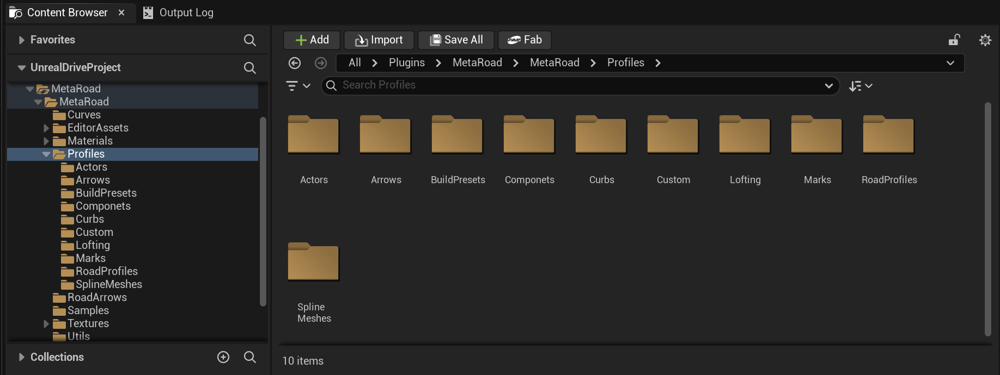  

## Driveable Material Profiles
Contains material profiles for **Road Lane** type **RoadLaneDriving**. You can specify the material and decals for driveable road lanes. These profiles are available in [Build Mesh Modeling Tool](ProcedureGenerationTool.md):  
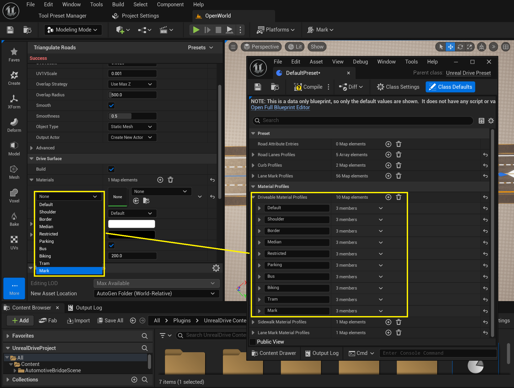

## Sidewalk Material Profiles
Contains material profiles for **Road Lane** type **RoadLaneSidewalk**. You can specify the material for sidewalk road lanes. These profiles will be available in [Build Mesh Modeling Tool](ProcedureGenerationTool.md):  
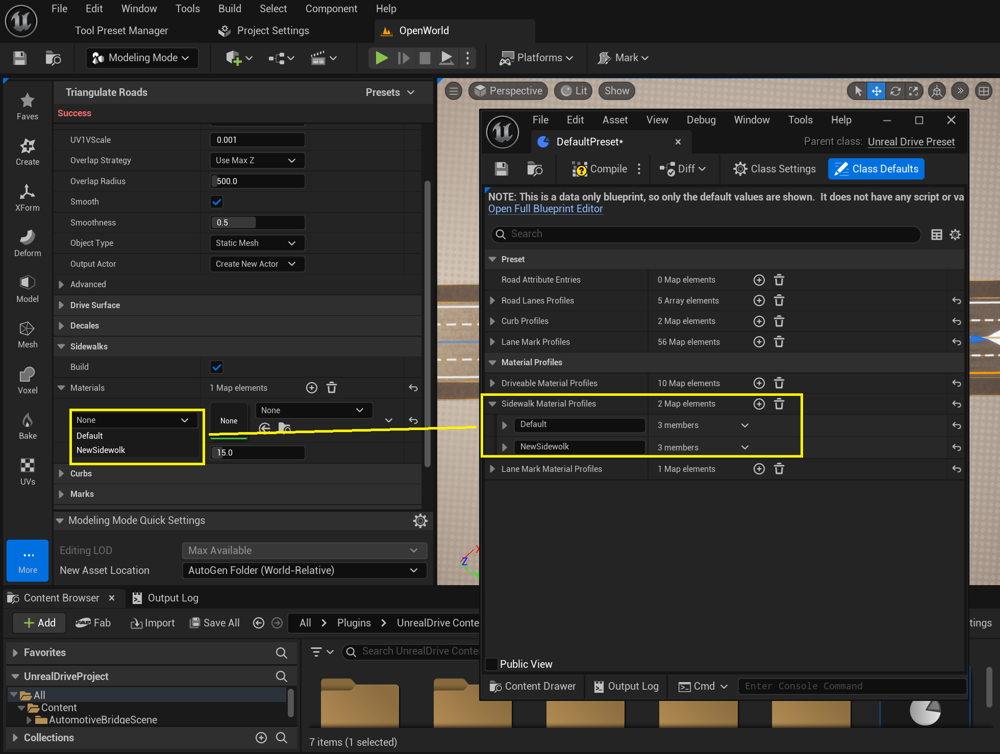

## Curb Profiles
Contains curb type profiles for **Road Lane** type **RoadLaneSidewalk**. You can set the curb material and geometry. These profiles are available in [Build Mesh Modeling Tool](ProcedureGenerationTool.md):  
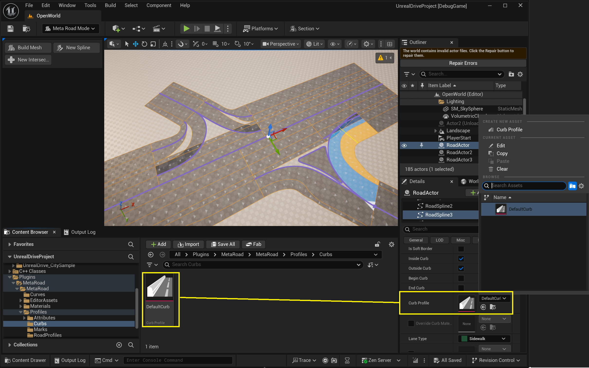

## Lane Mark Profiles
Contains profiles of road marking types for **Road Lane** type **RoadLaneDriving**. You can specify the type (solid, dashed, double), dimensions, and color of the marking strip. These profiles are available in [Road Mark Attribute](EditorModes.md#road-mark-attribute):   
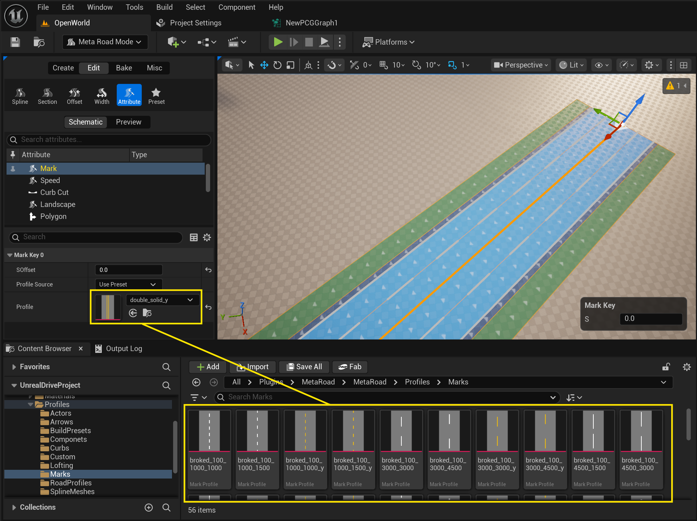  

## Road Lanes Material Profiles
Contains road marking material profiles for **Road Lane** type **RoadLaneDriving**. You can specify the Road Marks material. These profiles will be available in [Build Mesh Modeling Tool](ProcedureGenerationTool.md):  
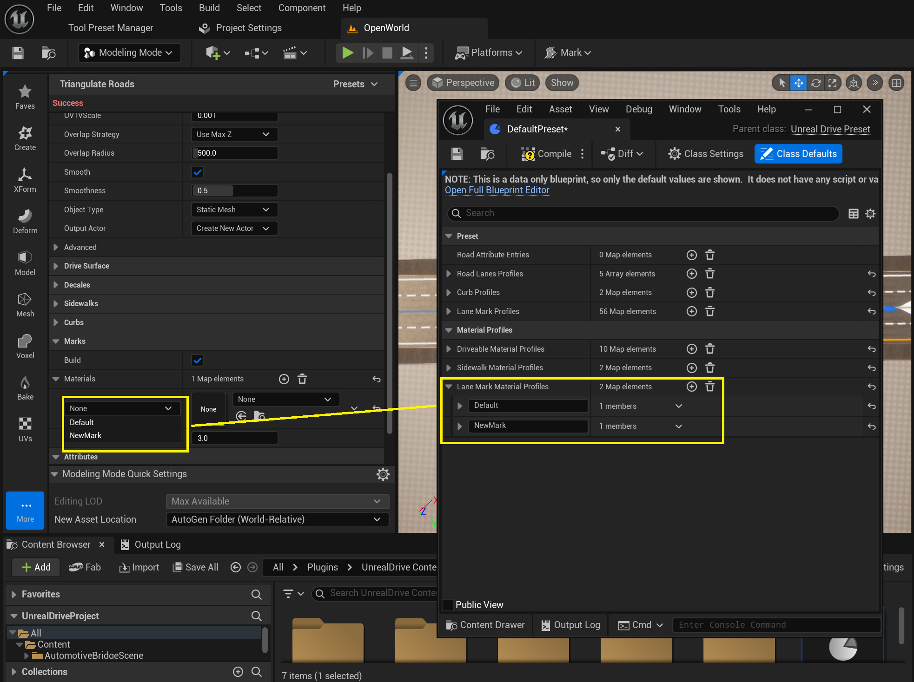  

## Road Lanes Profiles
Contains road section profiles for drawing in **Draw/Add Spline** [Build Mesh Modeling Tool](DrawTool.md#lane-source) -> **Road Profile**:  
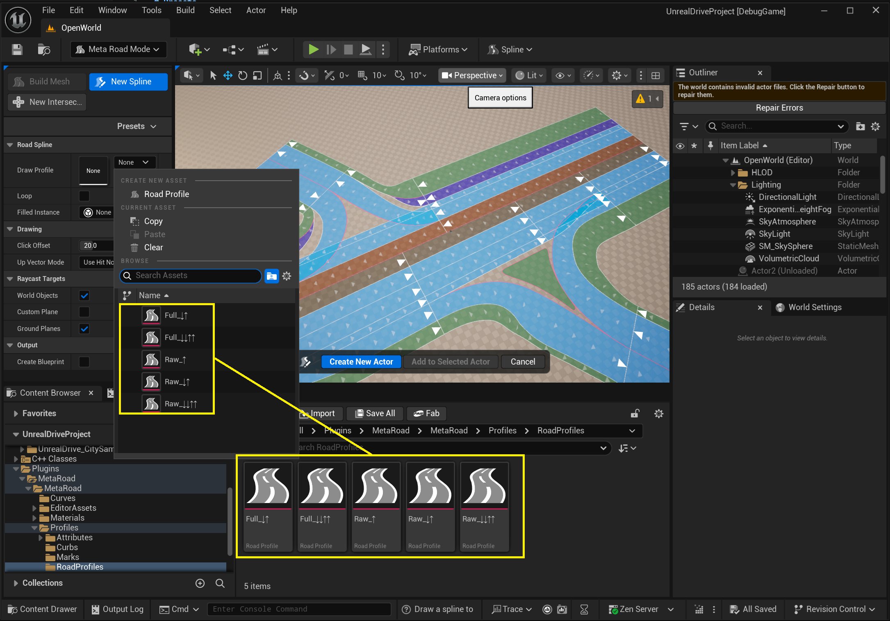  

## Road Attribute Entries
**Road Attribute Entry** is a helper constructor object that allows you to quickly create presets for [Lane Attribute](RoadModel.md#lane-attributes) and add them to Road Lane. All **Road Attribute Entries** from all presets are automatically available in [Road Attribute Editor Mode](EditorModes.md#attribute-modes):  
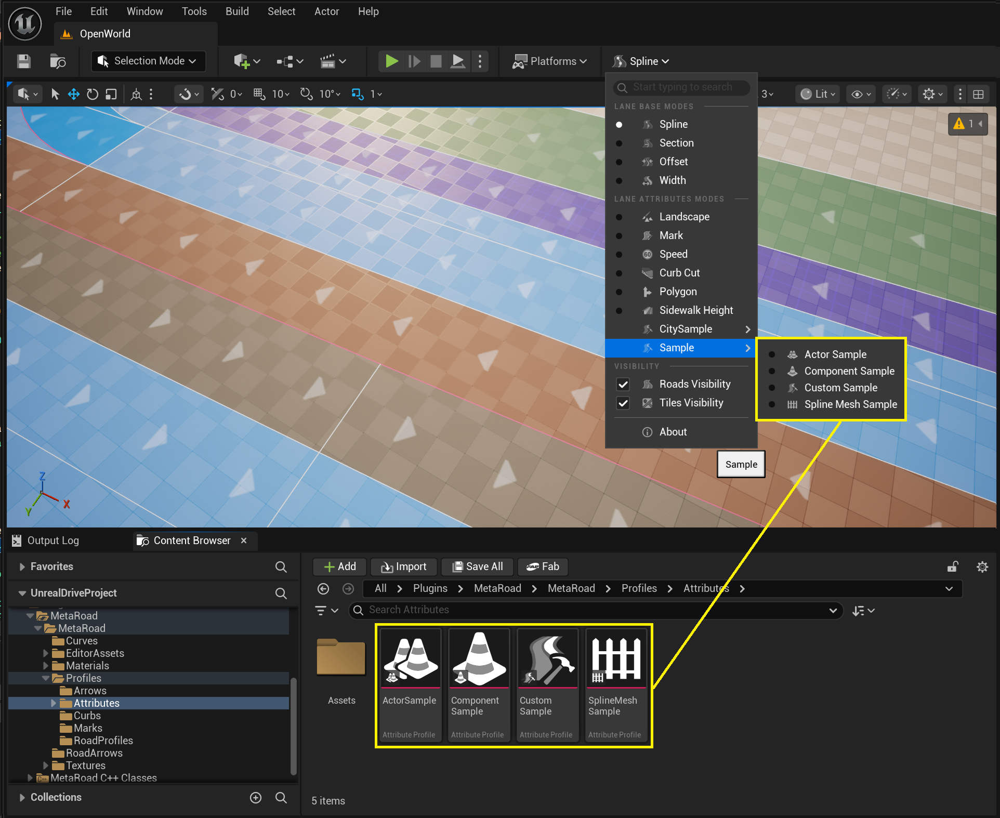   

There are 3 main types of **Road Attribute Entries** (Component Template, Spline Mesh, Custom Builder):  
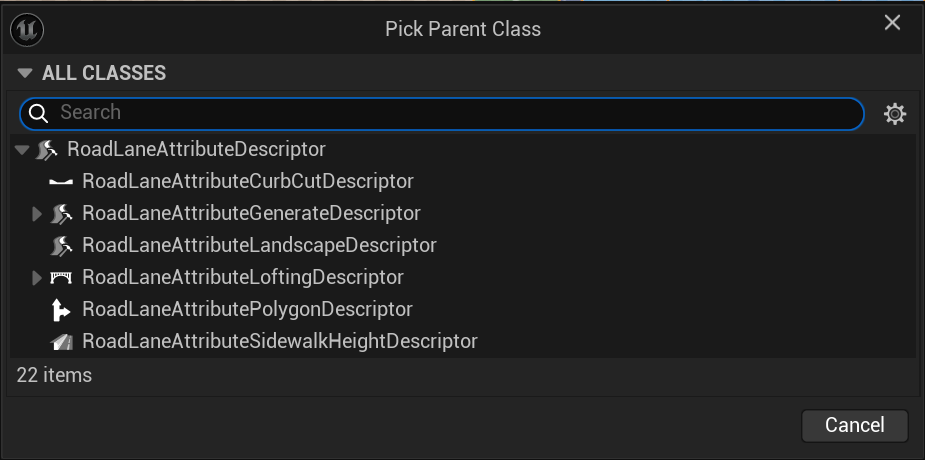  

### Component Template
Allows to generate arbitrary **USceneComponent** along **Road Lane** at a specified interval during the [Build Mesh](ProcedureGenerationTool.md) process.  
Simply create a BP or C++ class inherited from **USceneComponent**:  
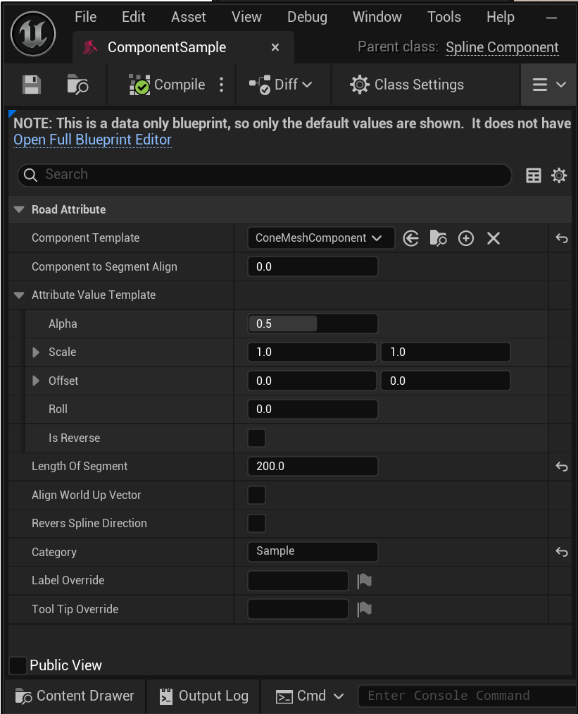  

Then, in **Road Attribute Entry**, specify the created class in ```Component Template``` and set ```LengthOfSegment```. After that, the created preset will be available in the [Lane Attribute](RoadModel.md#lane-attributes):  
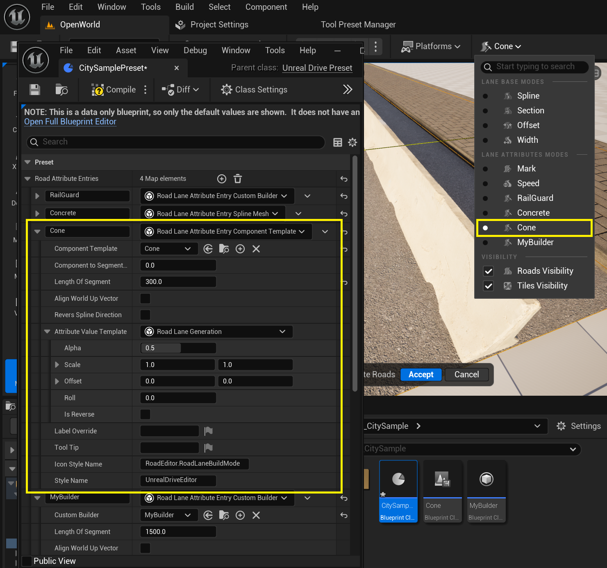  

And now it can be added to **Road Lane**:  
  

This template is convenient to use for repeating objects along **Road Lane**, such as traffic cones, flagpoles, lampposts, and power lines.

### Spline Mesh
Allows to generate **USplineMeshComponent** along **Road Lane** during the [Build Mesh](ProcedureGenerationTool.md) process.
To do this, specify the desired ```Static Mesh``` in **Road Attribute Entry** and set ```LengthOfSegment```, after which the created preset will be available in the [Lane Attribute](RoadModel.md#lane-attributes):  
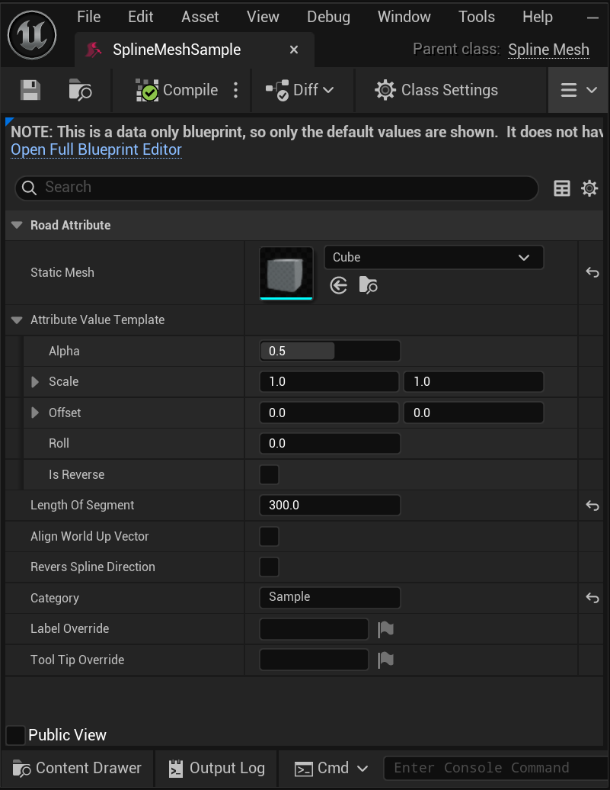  

And now it can be added to **Road Lane**:  
  

### Custom Builder
Provides the ability to write a custom attribute handler in C++ or BP during the [Build Mesh](ProcedureGenerationTool.md) process. 
To do this, need to create a class inherited from **UCustomSplineBuilder** and override the **Generate Asset** function:  
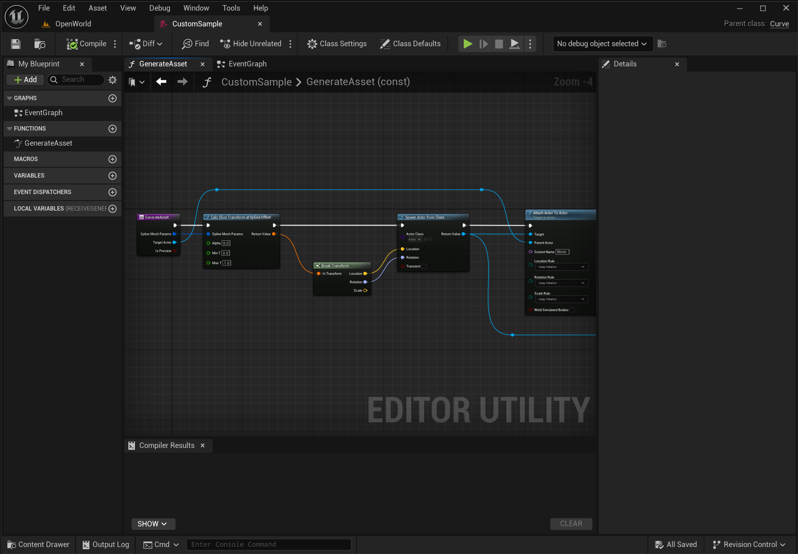  

After that, you need to specify the created class in the preset, and it will become available in [Lane Attribute](RoadModel.md#lane-attributes):  
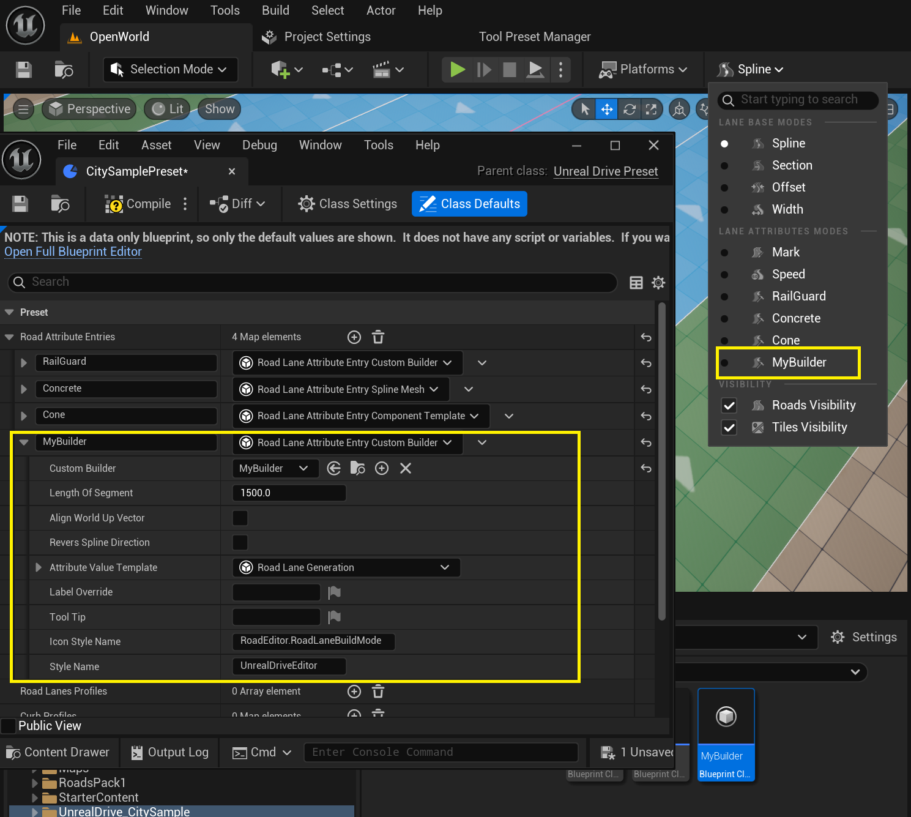  