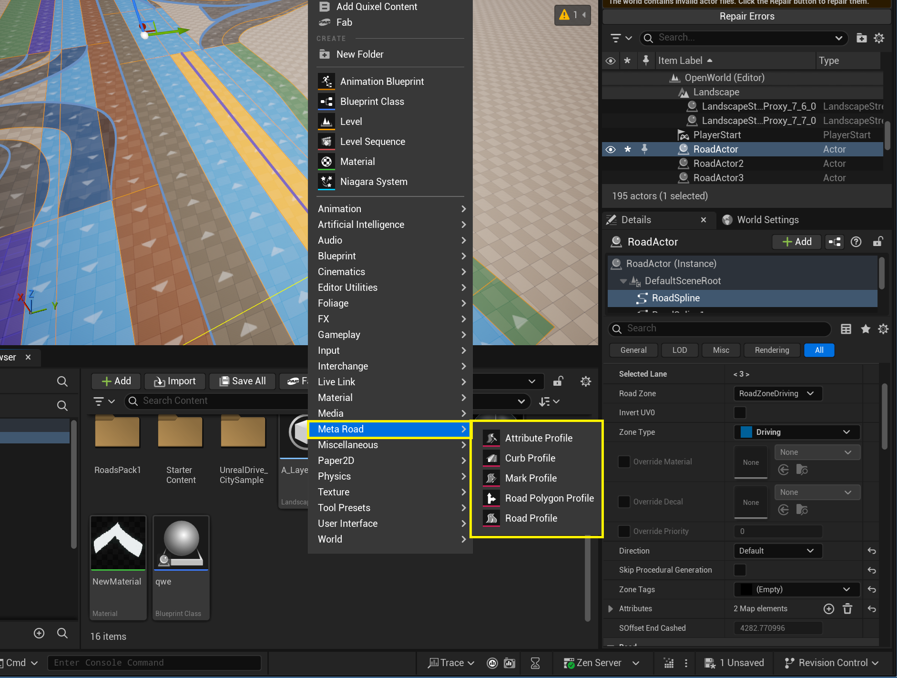
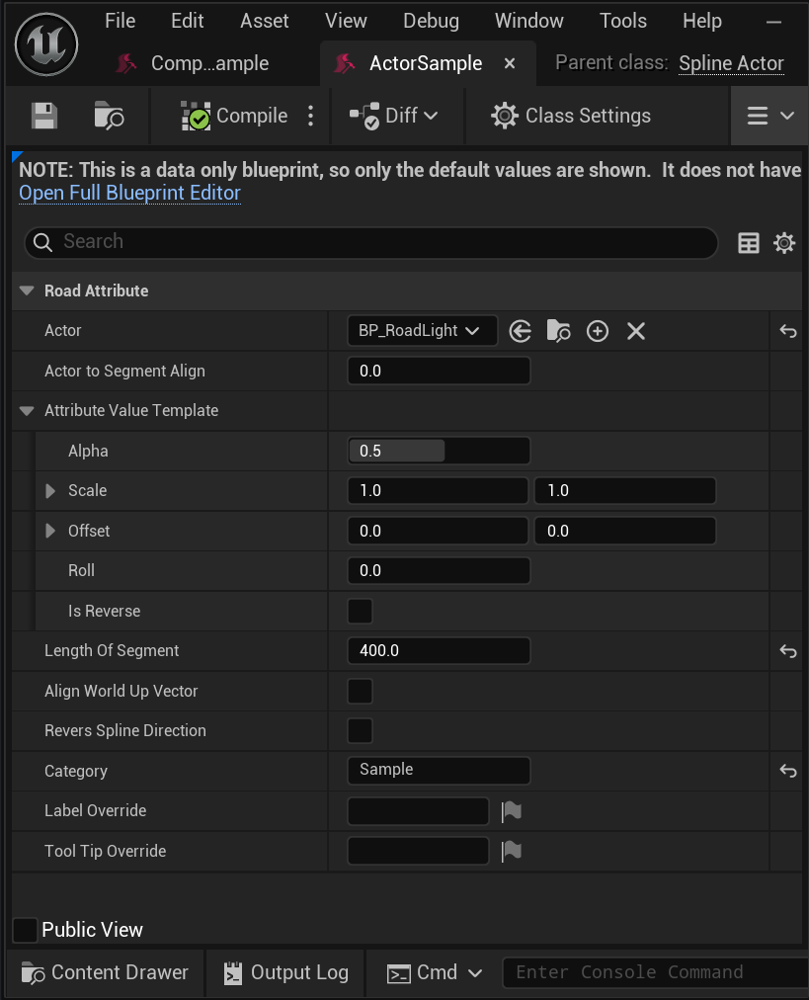

# Presets
MetaRoad offers the ability to create various "presets" of road elements and road logic.  
Each "preset" is an UnrealEngine asset that you can add in the **Content Browser** window under the **Meta Road** category:  
  

The MetaRoad already has a default presets at **/MetaRoad/DefaultPreset**. It should not be changed for backward compatibility:  
  

## Road Profile
Contains road drawing profile using in [New Spline Tool](DrawSplineTool.md#lane-source):  
  

## Curb Profile
Contains curb type profiles for **Road Lane** type **RoadLaneSidewalk**. You can set the curb material and geometry. These profiles are available in [Build Mesh Modeling Tool](ProcedureGenerationTool.md):  


## Mark Profile
Contains profiles of road marking types for **Road Lane** type **RoadLaneDriving**. You can specify the type (solid, dashed, double), dimensions, and color of the marking strip. These profiles are available in [Road Mark Attribute](EditorModes.md#road-mark-attribute):   
  

## Attribute Profile
**Road Attribute Entry** is a helper constructor object that allows you to quickly create presets for [Lane Attribute](RoadModel.md#lane-attributes) and add them to Road Lane. All **Road Attribute Entries** from all presets are automatically available in [Road Attribute Editor Mode](EditorModes.md#attribute-modes):  
   
Below is how to add attributes to a **Road Lane**:  
  
After selecting the option to create an **Attribute Profile**, you will be asked to select the base class of the **Attribute Profile**.  
  
There are 4 main types of **Attribute Profiles**:  
  - Curve Attribute
  - Spline Mesh Attribute
  - Component Template Attribute
  - Actor Template Attribute

### Curve
This is the base class for all attributes that generate objects along a road lane. It doesn't generate anything itself, but provides the **GenerateAssert()** method, which must be overridden in BP or C++:  
  
Example of such an asset at: */MetaRoad/MetaRoad/Profiles/Attributes/CustomSample*.

### Spline Mesh
Allows to generate **USplineMeshComponent** from ```Static Mesh``` along **Road Lane** at ```LengthOfSegment``` interval. 
  
Example of such an asset at: */MetaRoad/MetaRoad/Profiles/Attributes/SplineMeshSample*.

### Component Template
Allows to generate arbitrary **USceneComponent** from ```Component Template``` along **Road Lane** at ```LengthOfSegment``` interval. 
  
Example of such an asset at: */MetaRoad/MetaRoad/Profiles/Attributes/ComponentSample*.  
This template is convenient to use for repeating objects along **Road Lane**, such as traffic cones, flagpoles, lampposts, and power lines.

### Actor Template
Allows to generate arbitrary **AActor** from ```Actor``` along **Road Lane** at ```LengthOfSegment``` interval. 
  
Example of such an asset at: */MetaRoad/MetaRoad/Profiles/Attributes/ActorSample*. 