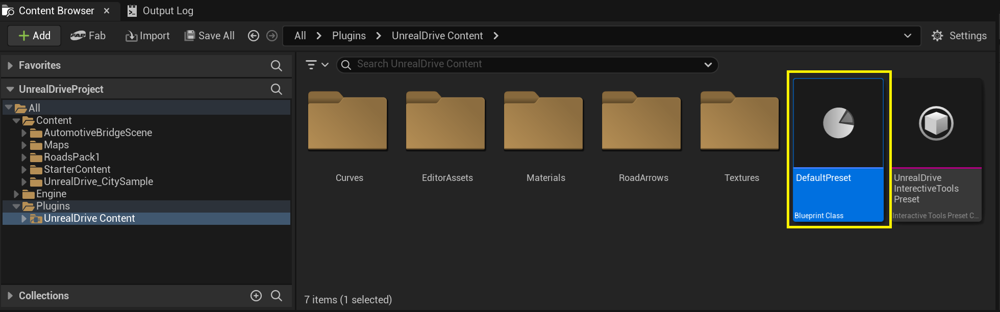
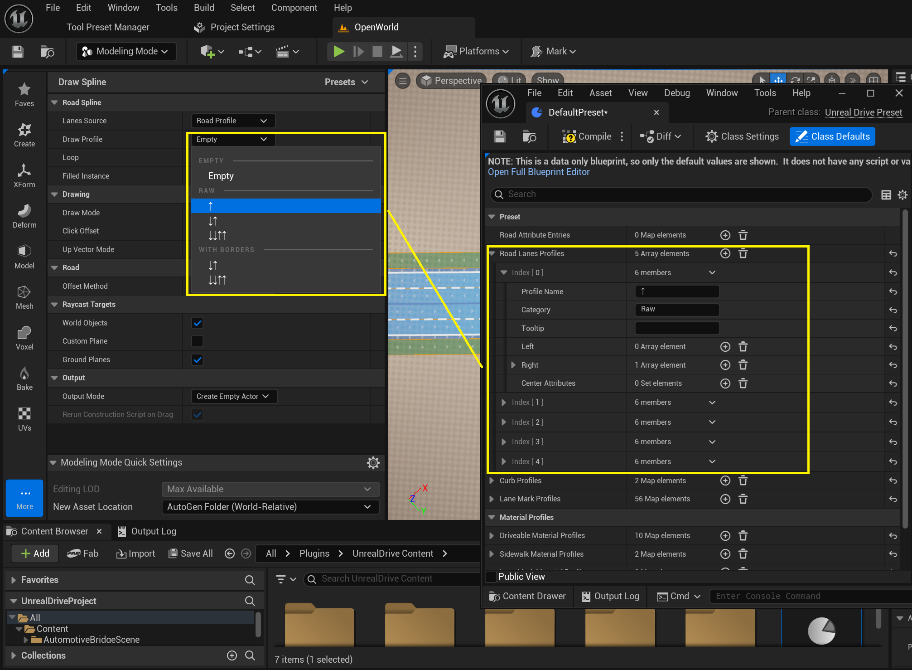

# Presets

**UUnrealDrivePreset** - класс, позволяющий хранить и использовать различные пользовательские присеты, такие как:
  - Профайлы для всех процедурно генерируемых объектов (поферхность дороги, сайдволки, маркировка, бордюры и др.)
  - The road lane attributes
  - Профайлы дорог для рисования (количество и типы полос) 
Пресетов в проекте может быть много, но UnrealDrive все они логически объеденяются в один. Поэтому нужно будет быть внимательным с именами профайлов в присетах, так как если в двух или более присетах будут найден профайлы с одинаковым именем, будет использоваться только один случайным образом.  
Для того, чтобы создать новый пресет, достаточно просто просто создать новый BP ассет в Content Browser, отнаследованный от UUnrealDrivePreset.  
  
**UUnrealDrivePreset** отнаследован от **UPrimaryDataAsset**, поэтому важно чтобы в  **Asset Manager -> Primary Assets to Scan** были добавлены соотвествующие пути, где был создан пресет. Обычно достаточно указать только две директории **/Game** и **/UnrealDrive**, но если вы создаете пресет внутри вашего плагина, то необходимо указать пути и до соотвествующих плагинов, где находится пресеты. Смотри раздел [Installation](Installation.md) за подробностями.  
Плагин UnrealDrive в контенете уже имеет дефолтный пресет. Его не следует менять для обратной совместимосьти, но могут быть случае, когда это можеть быть необходимо.  
  

## Lane Mark Profiles
Содержит дескрипторы типов дорожной разметки вдоль дорожных полос. Можно задать тип (сплошная, прерывистая, двойная), размеры и цвет полосы разметки. Эти профайлы, доступны в режиме [Road Mark Attribute](EditorModes.md#road-mark-attribute):   
  

## Curb Profiles
Содержит дескрипторы типов бордюров. Можно задать материал и геометрию бордюра. Эти профайлы, будут доступны в режиме [Build Mesh Modeling Tool](ProcedureGenerationTool.md):  


## Driveable Material Profiles
Содержит дескрипторы типов driveable road lanes. Можно задать материал и декали для driveable road lanes. Эти профайлы, будут доступны в режиме [Build Mesh Modeling Tool](ProcedureGenerationTool.md):  


## Sidewalk Material Profiles
Содержит дескрипторы типов sidewolk road lanes. Можно задать материал sidewolk road lanes. Эти профайлы, будут доступны в режиме [Build Mesh Modeling Tool](ProcedureGenerationTool.md):  


## Road Lanes Material Profiles
Содержит дескрипторы типов road marks. Можно задать материал road marks. Эти профайлы, будут доступны в режиме [Build Mesh Modeling Tool](ProcedureGenerationTool.md):  


## Road Lanes Profiles
Содержит дескрипторы дорожных секций для рисования в режиме **Draw/Add Spline** [Build Mesh Modeling Tool](DrawTool.md#lane-source) -> **Road Profile**: 


## Road Attribute Entries
**Road Attribute Entrie** - это объект-констуктор, который создает [Lane Attribute](RoadModel.md#lane-attributes). Все **Road Attribute Entries** из всех пресетов, автоматически добавляются и становтся доступны в [Road Attribute Editor Mode](EditorModes.md#attribute-modes)  
  
Есит 3 основных типа **Road Attribute Entrie** (Component Template, Spline Mesh, Custom Builder):  
  

### Component Template
Позволят генерировать произвольный **USceneComponent** вдоль **Road Lane** с заданным интервалом в процессе [Build Mesh](ProcedureGenerationTool.md).
Достаточно указать класс ```Component Template``` и ```LengthOfSegment```. Этот шаблон удобно использовать для потовряющихся объектов в доль **Road Lane**, напрмиер дорожные конусы, древки, фонарные столбы, линии электро передач.

### Spline Mesh
Позволят генерировать USplineMeshComponent вдоль **Road Lane**  в процессе [Build Mesh](ProcedureGenerationTool.md).

### Custom Builder
Отдает "управление" внешнему С++/BP скрипту  в процессе [Build Mesh](ProcedureGenerationTool.md).