# Build Mesh Modeling Tool
Этот Modeling Tool позволят генерировать ассеты (static meshes, dynamic meshes, spline mesh и др.) и создать Акторов с этими ассетами на сцене.  
Для работы этого Modeling Tool достаточно просто выделить один или несколько акторов, содержащих **URoadSplineComponent**, и активировать **Build Mesh Tool**, и он сразу отобразить предварительный результат:  
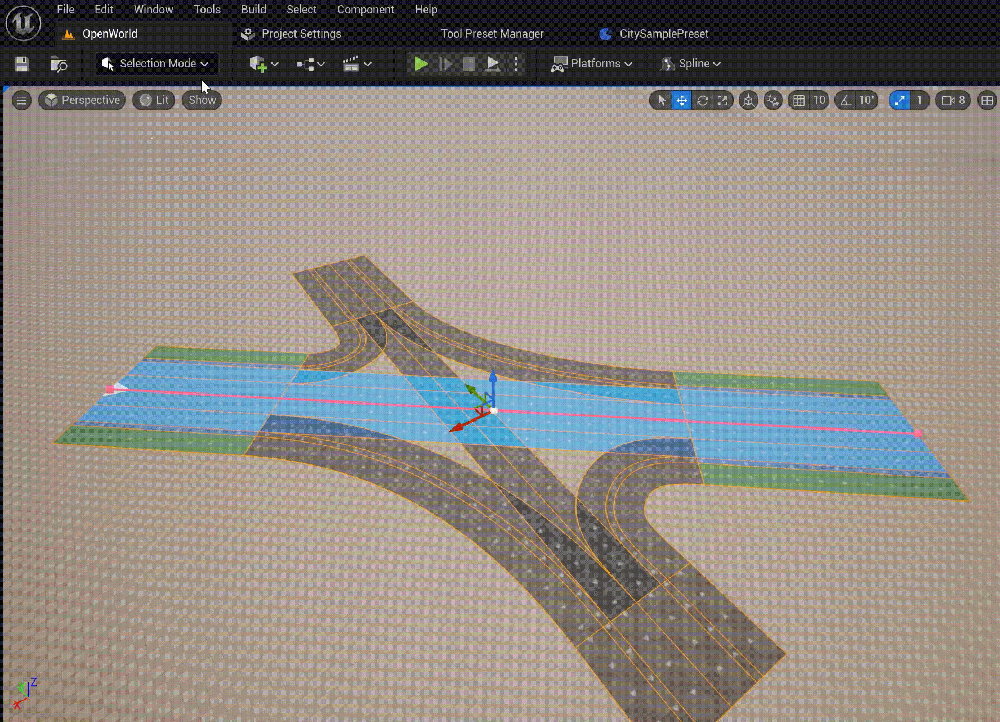  
Для доступа к **Build Mesh Tool**, необходимо переключить **Editor Mode** в режим **Modeling Mode** и выбрать **Road** toolset:  
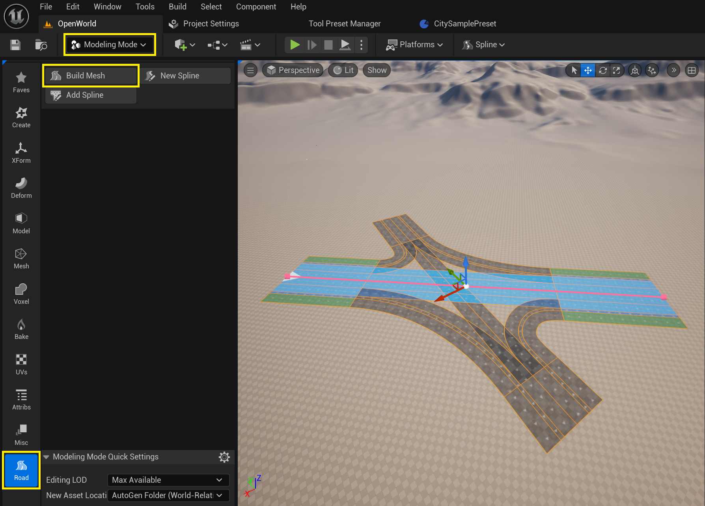  
После нажатия кнопки **Accept** для каждого выделенного актора, будет сгенерирован новый актор с постфиксом ```_Gen```. Например, для актора *RoadActor11* будет сгенерирован актор *RoadActor11_Gen*:
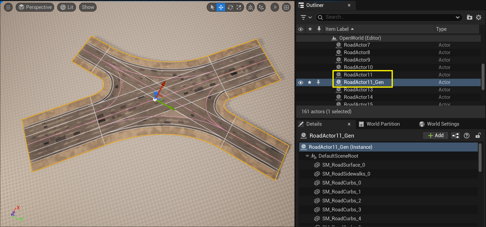  
Сгенерированный актор содержит ActorComponents (обычно UStaticMeshComponent, USplineMeshComponent) с ссылками на сгенерированные ассеты:  
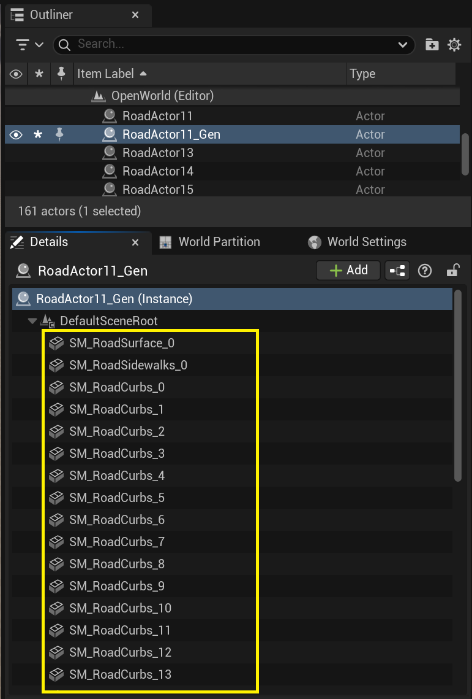  

**Build Mesh** отдельной генерит ассеты для:
  - Drive Surface + Decals
  - Sidewalks
  - Curbs
  - Marks
  - SplineMeshes

Для каждого из этих типов ассетов есть соответствующая группа параметров в **Build Mesh Tool**:  
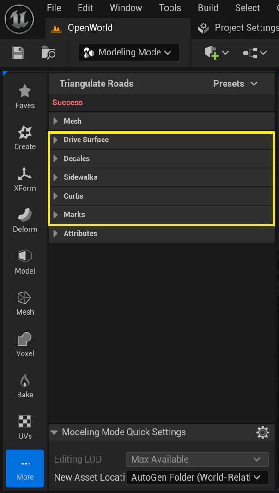  

## Mesh Materials
Для каждого типа генерируемого ассета (Drive Surface, Sidewalks, Curbs, etc) есть параметр **Materials**. Он позволяет подменить материалы из [Preset Profiles](Presets.md) установленных в **Road Lanes**:  
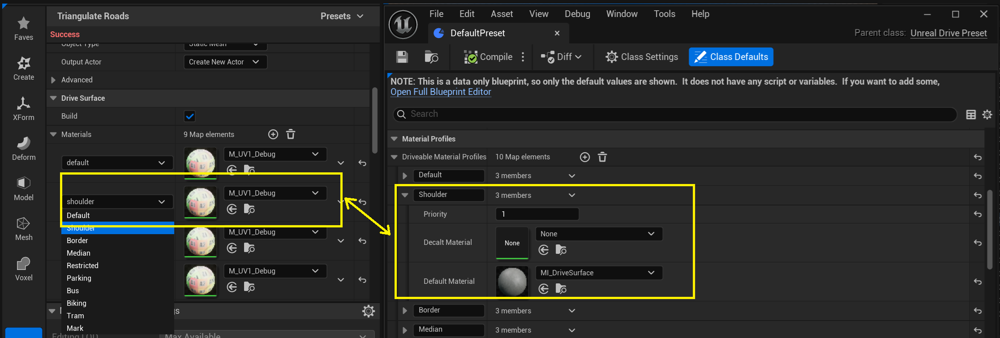  
Почему возникала в этом необходимость, в не просто определить все необходимые материалы в **Preset Profiles**?  
На практике в **Preset Profiles** обычно определяют "домены" профайлов, например **Tram** и ему устанавливают дефолтный мерила. А в **Build Mesh Tool** уже удобно переопределить дефолтный материал в случае необходимости. Такой подход более гибок, и позволят для одной и той же дороги быстро переключать сеты материалов, даже полученных из разных источников. Но ни кто не мешает в **Preset Profiles** создать несколько профайлов **Tram** (например **Tram-1**, **Tram-new**, **Tram-old**) и назначать соответствующие профайлы на **Road Lanes**.


## Mesh UVs
Процедурная генерация для Road Surface генерирует два уровня текстурных координат:  
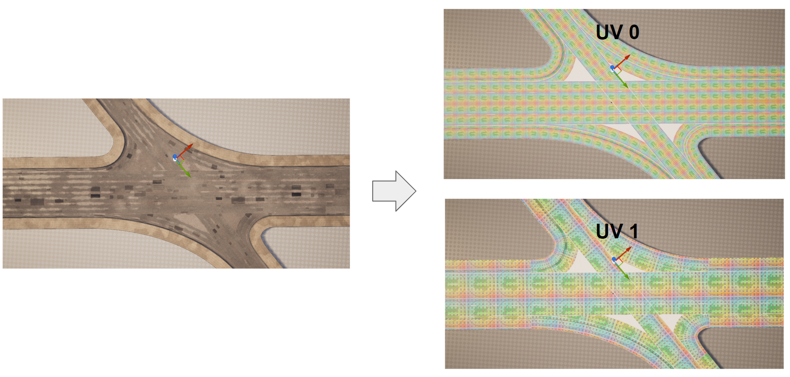
  - UV0 - отдельный трек для каждой полосы. UV0 удобно использовать для отображения дорожной колии или трамвайных путей.
  - UV1 - трек для левой и правой частей дороги. UV1 удобно использовать для отображения дорожных заплаток.

Для отображения дебажных материалов (как на картинке выше), необходом в меню **Project Settings -> Plugins -> Interactive Tool Presets** добавить **UnrealDriveInteractiveToolsPreset** в **Loaded Preset Collection**. После чего два пресета **UV0 Debug** и **UV1 Debug** станут доступны:   
  

## Mesh Vertex Color
В материалах для дорожной поверхности предлагается использовать mesh-атрибут **Vertex Color** для обозначения областей mesh там, где необходимо контролировать наличие текстур натянутых на каналы UV0 и UV1 (такие как лужи, колея, заплатки). Это позволит устранять артефакты на швах (областей перечиня нескольких **URoadSplineComponent**) и улучшать общий вид дорог.  
  
Для параметризации **Vertex Color** для **Drive Surface** предлагаются следующие параметры:  
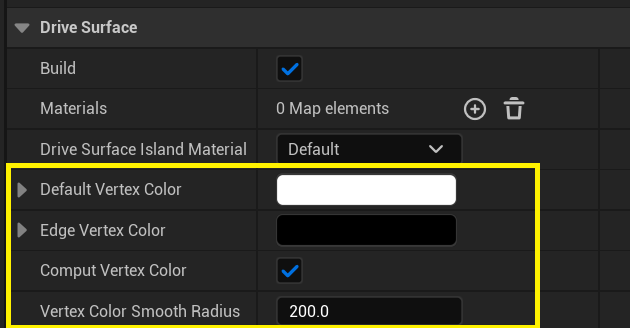  
Они сгенерировать цвет вершин в центре и на краях mesh, а так же в зонах пересечения полос:  
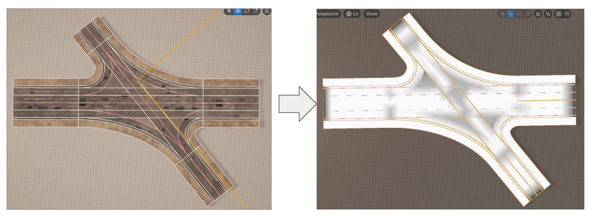  
Но для сложных перекрестков, скорее всего, придется "дораскрасить" вручную необходимые вершины в режиме **Mesh Paint**, как это было показано выше. В будущих релизах UnrealDrive возможно удастся усовершенствовать механизм генерации цвета вершин, что бы не приходилось обращаться к режиму **Mesh Paint**.

## Принцип группировки сплайнов
```{Important}
Важно понимать, что процедурная генерация дорог, воспринимает каждого актора (т.к. актора, содержащего содержащего хотя бы один **URoadSplineComponent**) как отдельную единицу генерации, не связанную с другими акторами и **URoadSplineComponent** на сцене. Отсюда следует два правила:
  - Группа **URoadSplineComponent**, представляющая собой перекресток или развязку, должна находиться внутри одного AActor.
  - Не следует в одного актора помещать слишком большие участки дорожной сети, в противном случае будут сгенерены большие static meshes, и сними UnrealEngine не эффективно работает в вопросах оптимизации рендеринга и физики.
```

Примеры:  
  - В этом пример четыре **URoadSplineComponent** компонента (SplineA_1, SplineA_2, SplineA_3, SplineA_3) находятся в одном акторе (ActorA), и соответственно процедурная генерация для актора ActorA примет во внимание все три сплайна, и правильно сгенерирует перекресток.  
  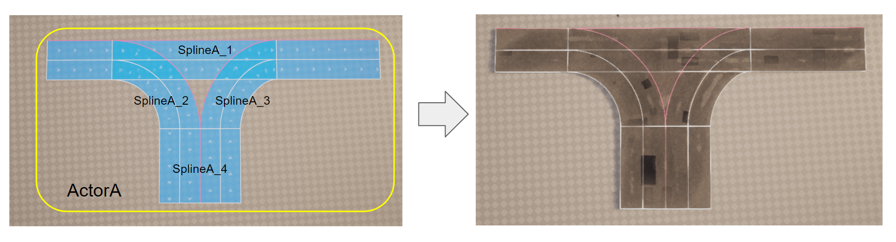
  - В этом примере уже два актора (ActorA и ActorB), включающие в себя по два компонента (SplineA_1, SplineA_2, SplineB_1, SplineB_2)
  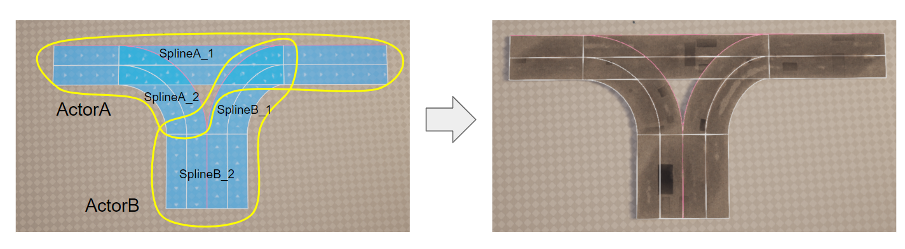  
  Так происходит потому-что сплайны SplineA_1 + SplineA_2 и SplineB_1 + SplineB_2 триангулируются отдельно, и получится следующий результат:  
  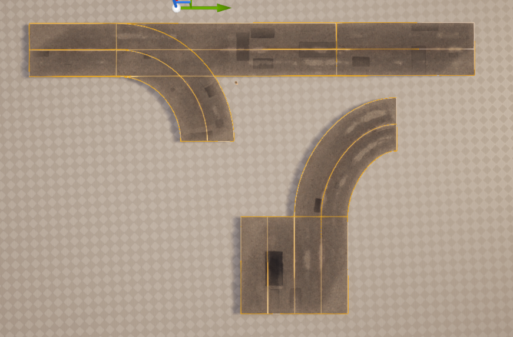  
  - Этот пример показывает, как следует разбивать дорожную сеть на акторы, по прицепу - каждый перекресток/развязка помещен в отдельный актор.  
  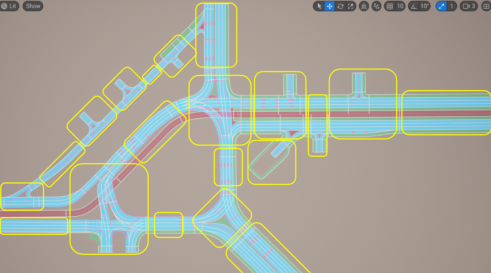  

Именно поэтому, для удобства, введено два режима рисования сплайнов **New Spline** и **Add Spline** (смотри [New/Add Spline Modeling Tools](DrawTool.md)) - это позволяет или добавлять новый сплайн в актор, или создавать новый актор со сплайном внутри.
