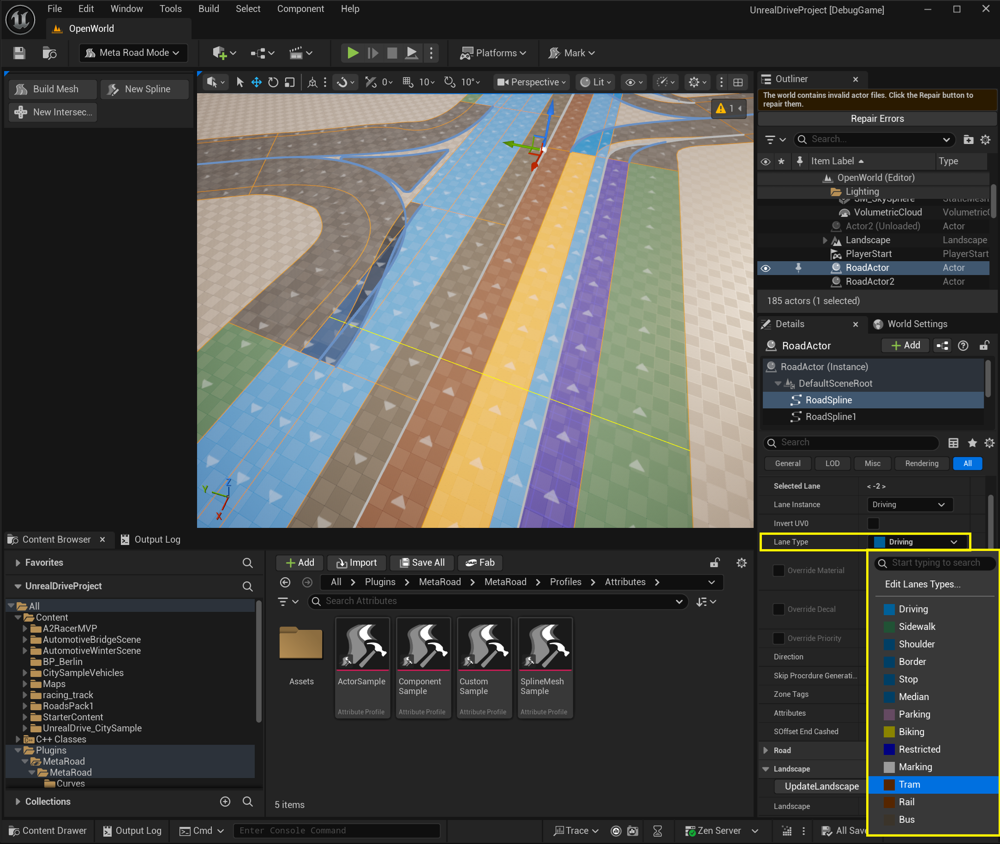
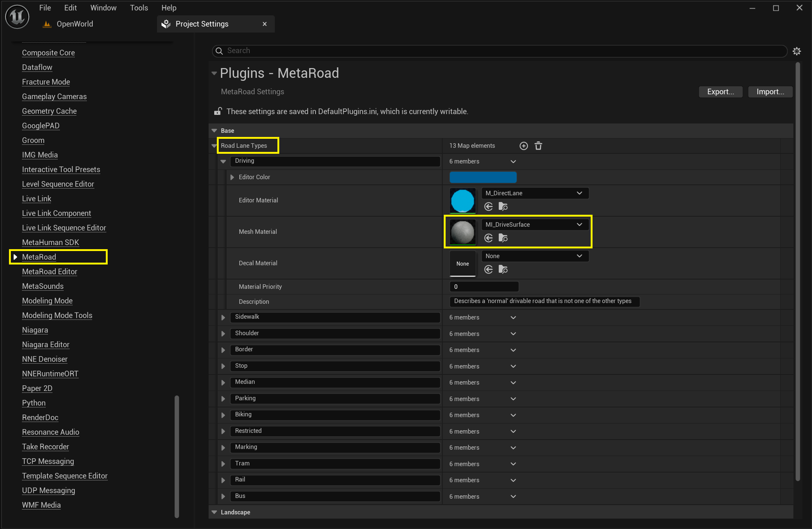
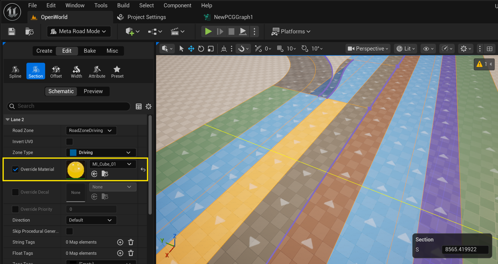
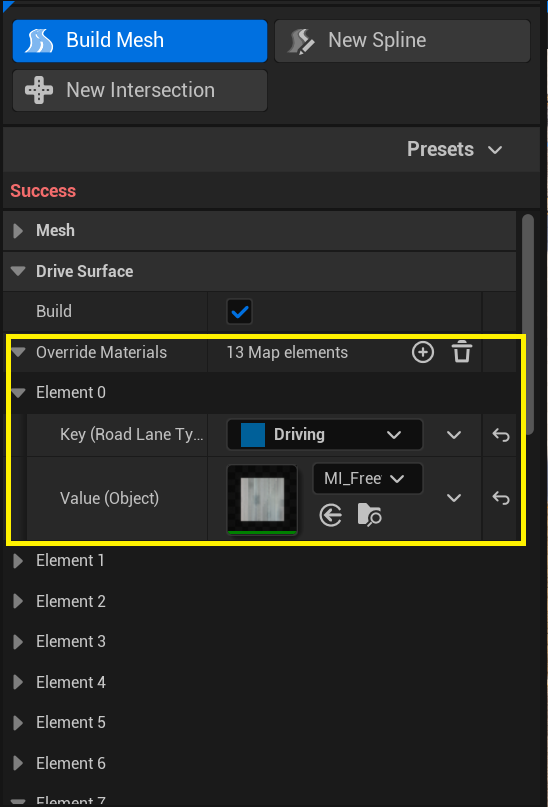
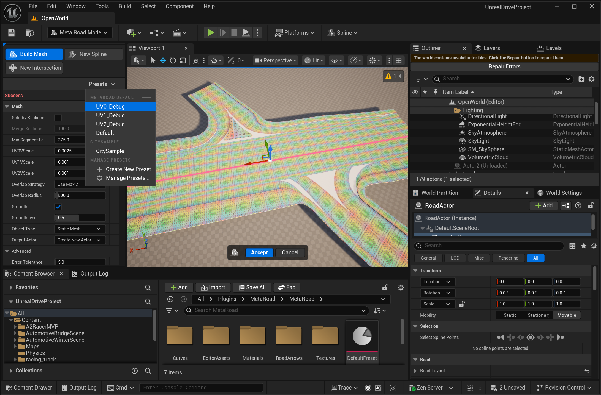

## Build Mesh Tool
This Modeling Tool allows you to generate assets (static meshes, dynamic meshes, spline meshes, etc.) and create Actors with these assets on the scene.  
To use the **Build Mesh Tool**, simply select one or more actors containing **URoadSplineComponent**, activate the **Build Mesh Tool**, and it will immediately display the preliminary result:  
  

To access the **Build Mesh Tool**, switch **Editor Mode** to **Modeling Mode** and select the **Road** toolset:  
  

After clicking the **Accept** button for each selected actor, a new actor with the suffix ```_Gen``` will be created. For example, for the actor *RoadActor11*, the actor *RoadActor11_Gen* will be generated:  
  

The generated actor contains ActorComponents (usually UStaticMeshComponent, USplineMeshComponent) with references to the generated assets:  
  

The **Build Mesh Tool** separately generates assets for:
  - Drive Surface + Decals
  - Sidewalks
  - Curbs
  - Marks
  - SplineMeshes

For each of these asset types, there is a corresponding group of parameters in the **Build Mesh Tool**:  
  

### Mesh Lane Materials
All road lanes have a ```Lane Type```:  
  
You can add new ```Lane Type``` in the **Project Settings**. Each ```Lane Type``` also has a ```Default Material```:
  
For a selected road lane, you can override the default lane material:
  
You can also override the default ```Lane Type``` material from the  **Build Mesh Tool** settings:  
  
Thus, the priority of determining the road lane material is as follows:  
  -> Default material from ```Lane Type``` description  
  -> Override materials from the **Build Mesh Tool**  
  -> Override materials from the selected road lane menu 

### Mesh UVs
Procedural generation for Road Surface generates two levels of texture coordinates:  
  - UV0 - a separate track for each lane. UV0 is useful for displaying road ruts or tram tracks.
  - UV1 - a track for the left and right sides of the road. UV1 is useful for displaying road patches.

  

To display debugging materials (as shown in the image above), you need choose **UV0 Debug**, **UV1 Debug** or **UV0 Debug** preset:  
  

### Mesh Vertex Color
For road surface materials, we recommend using the **Vertex Color** mesh attribute to designate areas of the mesh where you need to control the presence of textures stretched across the UV0 and UV1 channels (such as puddles, ruts, and patches). This will eliminate artifacts at the seams (areas where several **URoadSplineComponent** intersect) and improve the overall appearance of the roads:  
  

The following parameters are suggested for parameterizing **Vertex Color** for **Drive Surface**:  
  

These parameters allow to set the color of vertices in the center and at the edges of the mesh, as well as in the areas where lanes intersect:  
  

However, for complex intersections, you will most likely have to manually "paint" the necessary vertices in **Mesh Paint**mode, as shown above. In future releases of MetaRoad, it may be possible to improve the vertex color generation mechanism so that you don't have to resort to **Mesh Paint** mode.

### The principle of spline grouping
```{Important}
It is important to remember that procedural road generation treats each actor containing at least one **URoadSplineComponent** as a separate generation unit, unrelated to other actors and **URoadSplineComponent** on the scene. This leads to two rules:
  - A group of **URoadSplineComponents** representing an intersection or junction must be located within a single AActor.
  - Do not place too large sections of the road network in a single actor, otherwise large static meshes will be generated, and UnrealEngine will not work efficiently in terms of rendering and physics optimization.
```

Examples:  
  - In this example, four **URoadSplineComponent** (SplineA_1, SplineA_2, SplineA_3, SplineA_4) are located in one actor (ActorA), and accordingly, procedural generation for ActorA will take all four splines into account and correctly generate the intersection.    
    
  - In this example, there are already two actors (ActorA and ActorB), each containing two components (SplineA_1, SplineA_2, SplineB_1, SplineB_2):  
      
    
    This happens because splines SplineA_1 + SplineA_2 and SplineB_1 + SplineB_2 are triangulated separately, resulting in the following outcome:  
      

  - The following example shows how to divide the road network into actors, based on the principle that each intersection/junction is placed in a separate actor:  
      
    </br>
    That is why, for convenience, two modes for drawing splines have been introduced: **New Spline** and **Add Spline** (see [Draw Modeling Tools](DrawTool.md)). This allows to either add a new spline to an actor or create a new actor with a spline inside it.
