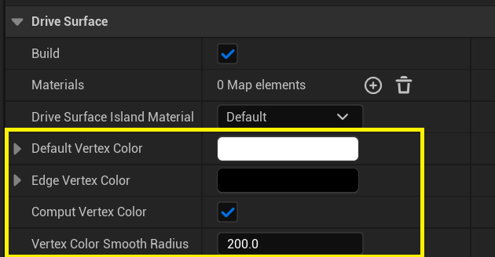
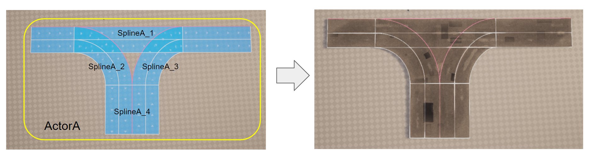
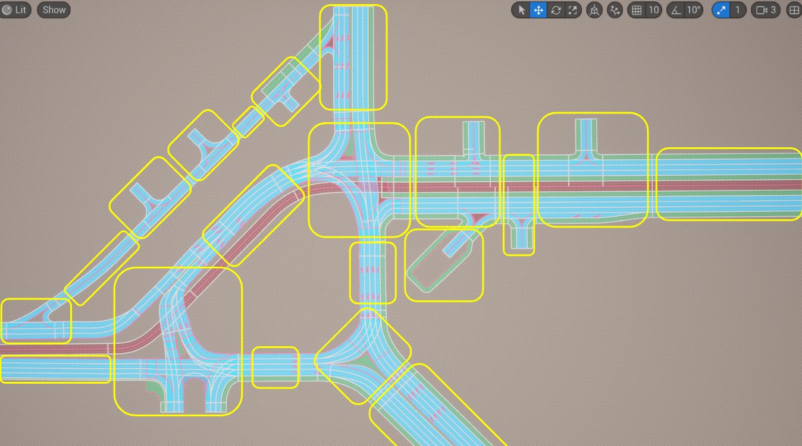

# Build Mesh Modeling Tool
Этот режим позволят генерировать ассеты (static meshes, dynamic meshes и spline mesh) для одного или несольких выделенных актовров, содержажих URoadSplineComponent. Отдельной генерит ассеты для:
  - Drive Surface + Decales
  - Sidewolks
  - Curbs
  - Marks
  - SplineMeshes
Для каждого из этих типов ассетов есть сотвествующия группа параметров.

## Mesh Materials
Для каждого типа типа генерируемого ассета есть есть параметр **Material**. Он позволяет задать матриал из профайла матриалов.


## Mesh UVs
Процедурная генерация для Road Surface генерирует два уровня тектурных координат:

  - UV0 - отдельный трек для каждой полосы. Его удобно использовать для отображения, например, дорожный колии или драмвайных путей.
  - UV1 - трек для левой и правой частей дороги. Его удобно использовать для отображения, например, заплаток на дороге или ям.

Для отображения дебажных материалов как на картинке выше, необходмо в меню **Project Settings -> Plugins -> Interactive Tool Presets** добавить **UnrealDriveInterectiveToolsPreset** в **Loadad Preset Collection**. После чего два пресета **UV0 Debug** и **UV1 Debug** станут доступны в сохраненных престах.  


## Mesh Vertex Color
В метериалах для дорожной поверхности предлагается использовать атрибут Vertex Color для обозначения областей mesh, где присутсвуют лужи, дорожная колея и другие детали, которые необходимо контролировать на швах и пересечениях дорожных полос. Это позволит устранять артефакты генерации на швах и улучшать общий вид дорог.   

Для параметризации Vertex Color для Drive Surfaсe предлагаются следующие параметры:  
  
Они сгенерировать цвет вршин в центре м на краях меша, а так же в зрнах пересения полос:  
  
Но для сложных перекретскеов, вам, скорее всего, придется "дораскарасить" необходмые вершины вручную в режиме Mesh Paint, как это было показано выше. В будующих релизах UnrealDrive возможно удасть усовершенствовать механизм генерации цвета вершин, что бы не приходилось обращаться к режиму MeshPaint

## Принцип группировки сплайнов
```{Important}
Важно понимать, что процедурная генерация дорог, воспринимает каждого актора (содержащего хотябы один URoadSplineComponent) как отдельную единицу генерации, не связанную с другими акторами и сплайнами на сцене.
Отсюда следует два правила:
  - Группа URoadSplineComponent, представляющая собой перекресток или развзяку, должна находиться внутри одного AActor.
- Не следует в одного актора помещать слишком большие участки дорожной сети, в противном случае будут сгенерены большие static meshes, и сними UnrealEngine не эффективно работает в вопросах оптимизации рендеринга и физики.
```

Примеры:  
  - В этом пример четыре URoadSplineComponent компонента (SplineA_1, SplineA_2, SplineA_3, SplineA_3) находятся в одном акторе (ActorA), и соотвественно процедурная генерация для актора ActorA примит во внимание все три сплайна, и правильно сгенерирует перекресток.  
  
  - В этом примере уже два актора (ActorA и ActorB), включающие в себя по два компонента (SplineA_1, SplineA_2, SplineB_1, SplineB_2)
    
  Так происходит потому-что сплайны SplineA_1 + SplineA_2 и SplineB_1 + SplineB_2 триангулируются отдельно, и получится следующий результат:  
    
  - Этот пример показывает, как следует разбивать дорожную сеть на акторы, по принцепу, каждый перекресток/развязка помещен в отдельный актор.  
    

Именно поэтому, для удобства, введено два режима рисования сплайнов **New Spline** и **Add Spline** - это позволяет или добавлять новый сплайн в актор, или создавть новый актор со спланом внутри.
