# Road Model

## Basic concepts
The ActorComponent **URoadSplineComponent** forms the basis of the road network model and the entire UnrealDrive plugin. 
**URoadSplineComponent** is the only component needed to represent a road network graph. Although the component itself describes only a single simple road segment, a combination of **URoadSplineComponent** can describe even very complex road networks, interchanges, and intersections.  
Any section of the road network on the scene is an arbitrary AActor that includes one or more **URoadSplineComponent**, with one road typically consisting of one **URoadSplineComponent** and intersections or junctions consisting of several.
Those familiar with the [ASM OpenDrive](https://www.asam.net/standards/detail/opendrive/) specification will find all the ideas implemented in **URoadSplineComponent** very familiar.  
Indeed, UnrealDrive has emphasized much of this specification.

## Road Reference Line
**URoadSplineComponent** - inherits from [USplineComponent](https://dev.epicgames.com/documentation/en-us/unreal-engine/API/Runtime/Engine/USplineComponent), i.e. it has all the properties of the base spline, which is the reference line along which the road is generated.  
The reference line is marked in pink. It is a left-handed coordinate system. The S-axis (or S-Offset in UI) follows the tangent of the road reference line. The R-axis (R-Offset in UI) is orthogonal to the S-axis and may be rotated around the S-axis by superelevation. The left-handed coordinate system is completed by defining the up-direction H orthogonal to S-axis and R-axis.

## Road Lanes
Lanes are an essential part of all roads. Lanes are attached to the road reference line of the road and are defined from inside to outside. A minimum road definition requires a center lane and an additional lane with a defined width. The number of lanes per road is not limited.
The center lane has no width and serves as reference for lane numbering. The center lane itself has the lane index 0. The numbering of the other lanes starts at the center lane: Lane numbers descend to the right, meaning a positive  R-direction, and ascend to the left, meaning a negative R-direction.
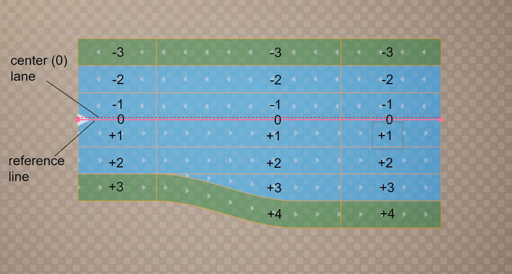  
This figure shows the center lane for a road with multiple traffic lanes and different driving directions. In this case, the center lane separates the driving directions, depending on left- and right-hand traffic, specified in Road type. Because no lane offset is used, the center lane is identical to the road reference line.

### Lane Types
The lane type is defined per lane. A lane type defines the main purpose of a lane and its corresponding traffic rules. There are basic types (such as driving, shoulder, border, biking, etc.) and user-defined types (which can be added via the C++ API).  
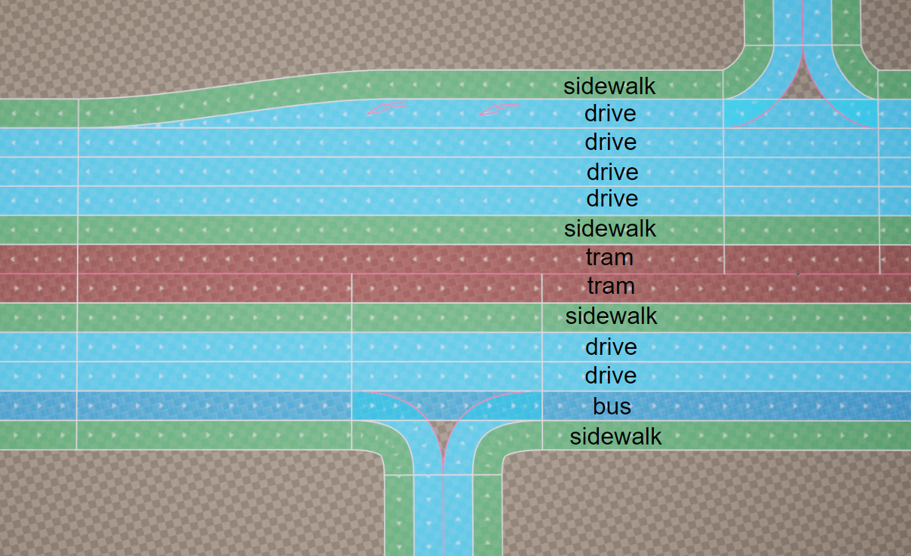  

### Lane Direction
Each road lane has a direction. On the graphs, this direction is shown by white moving arrows. This direction is specified by a combination of different elements and attributes. For any individual lane, you can change the direction of movement.  
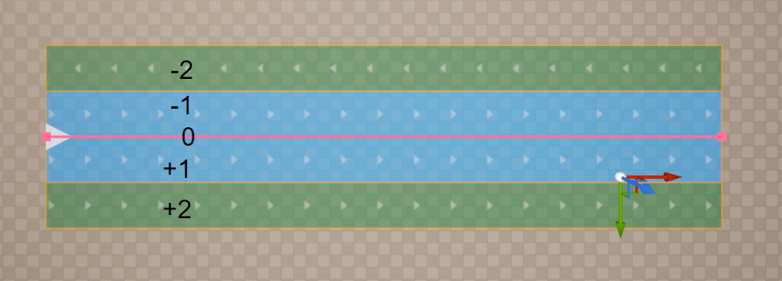  
This figure shows that the line with index -1 has an inverted direction.

### Lane Groups
For easier navigation through road description, the lanes within a lane section are grouped into left, center, and right lanes.
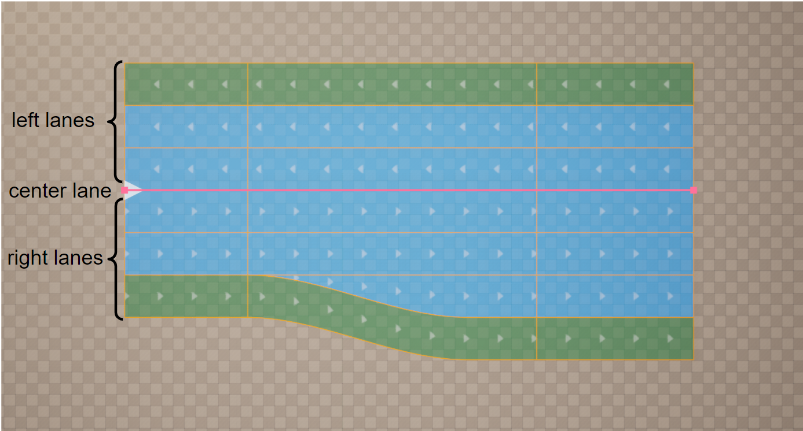

### Lane Sections
Lanes may be split into multiple lane sections. Each lane section contains a **fixed number of lanes**.  
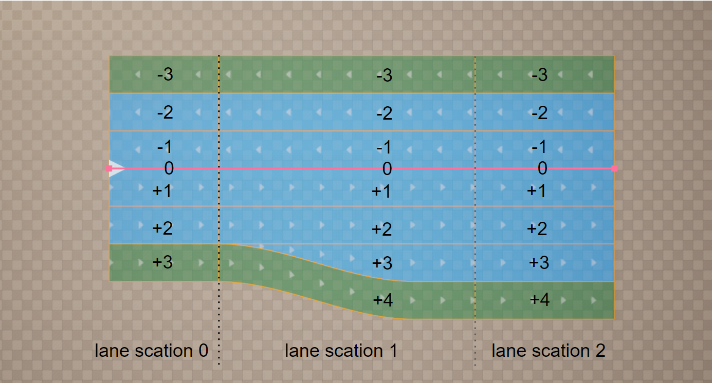  
This figure shows that every time the number of lanes changes, a new lane section is required. Lane sections are defined in ascending order along the road reference line.  

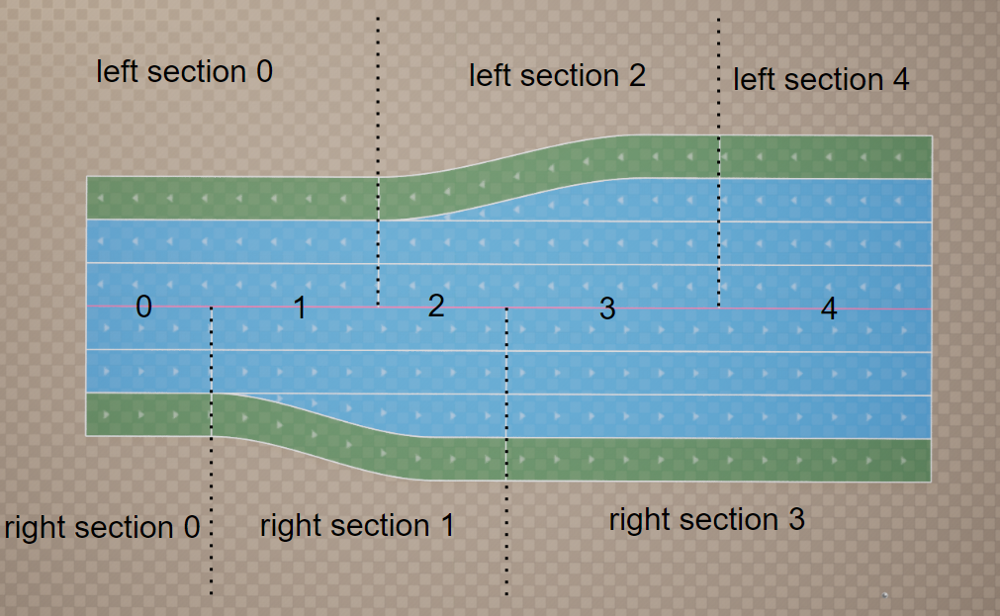  
This figure shows how lane sections for complex roads may be defined for one side of the road only - left, right and both sides

### Lane Offset
A lane offset may be used to shift the center lane away from the road reference line. This makes it easier to model local lateral shifts of lanes on roads, for example for left turn lanes.  
A combination of lane offset and shape definition can lead to inconsistencies depending on the interpolation used for the lane offset. Because linear interpolation is used for the road shape along the road reference line, linear interpolation should also be used for the offset definition to enable consistent combined use of both definitions.  
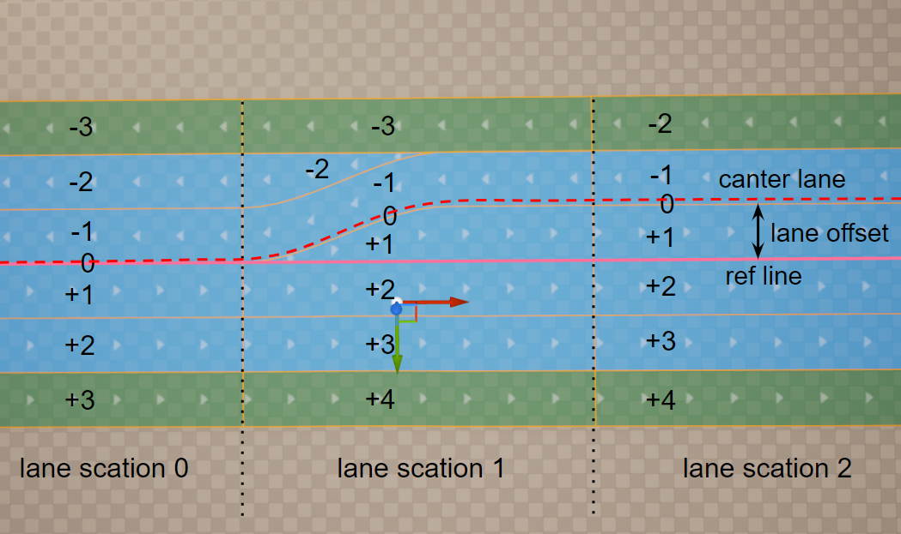  
This figure shows the offset of the center lane away from the road reference line.

### Lane Attributes
Lane attributes are arbitrary metadata that can be assigned along a **Road Lane**.  
This is one of the most powerful tools for customizing and adding new features to UnrealDrive. Users can register and define the behavior of any number of attributes. Attributes can be used to customize procedural generation (e.g., to designate sections of uneven road), to define traffic priorities and speed limits (e.g., to generate road traffic), to generate spline meshes (e.g., to generate fences along the lane or vegetation), and more.  
An attribute has the following properties:
  - An attribute has a unique name (e.g., speed, mark, fence), which is the attribute type.
  - The added attribute applies to the entire **Road Lane**.
  - The attribute has one or more **Attribute Keys**.
  - The first **Attribute Key** is fixed at the beginning of the **Road Lane** (SOffset = 0). 

**Attribute Key**  is a pair of values **SOffset** & **Attribute Data**:
  - **SOffset** is the position of the **Attribute Key**, SOffset equal to 0 is the beginning of the **Road Lane**. 
  - **Attribute Data** is an arbitrary C++ or BP structure (for example, speed limits, traffic density, type of grass on the roadside, etc.).  
  
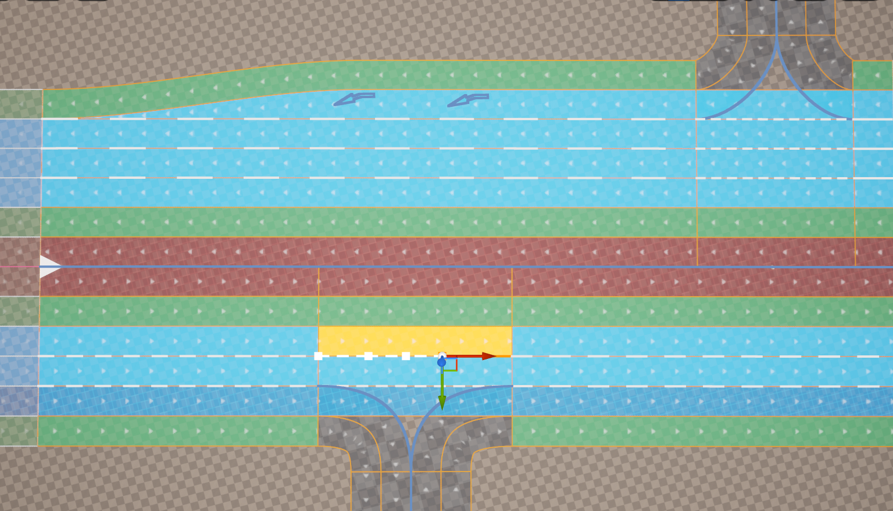  
This figure shows a visualization of the ```Speed``` attribute. In this example, only one **Road Lane** with ID ```+1``` in **Road Section** ```1``` has the ```Speed``` attribute. This attribute sets the speed of traffic on the **Road Lane** and has three keys with SOffset coordinates: 0cm, 400cm, and 800cm. The key contains only one **Attribute Data** field - a floating point value ```Speed```. The three keys from the example have the following corresponding **Attribute Data**: 20km/h, 60km/h, 100km/h.

## Intersections and Junctions
UnrealDrive does not have special types or classes that could be responsible for creating intersections or junctions. Instead, UnrealDrive offers the ability to link multiple **URoadSplineComponent** together. In turn, a group of linked **URoadSplineComponent** can naturally represent an intersection or junctions.  

As mentioned earlier, each Road Lane has a direction. Along this direction, there is a **Lane Predecessor Connection** at the beginning and a **Lane Successor Connection** at the end. Similarly, each **URoadSplineComponent** spline also has a direction, a beginning, and an end. These beginnings and ends are an **Road Predecessor Connection** and **Road Successor Connection**.   
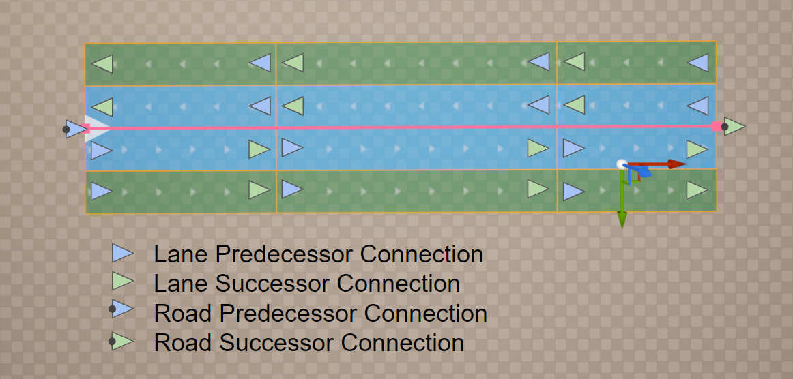  

There are only two rules for linking:
  * **Road Successor Connection** -> **Lane Predecessor Connection** (one-to-many connection)  
    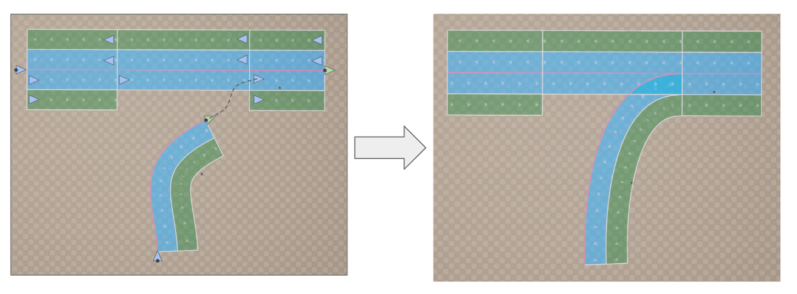 
  * **Road Predecessor  Connection** -> **Lane SuccessorConnection** (one-to-many connection)  
    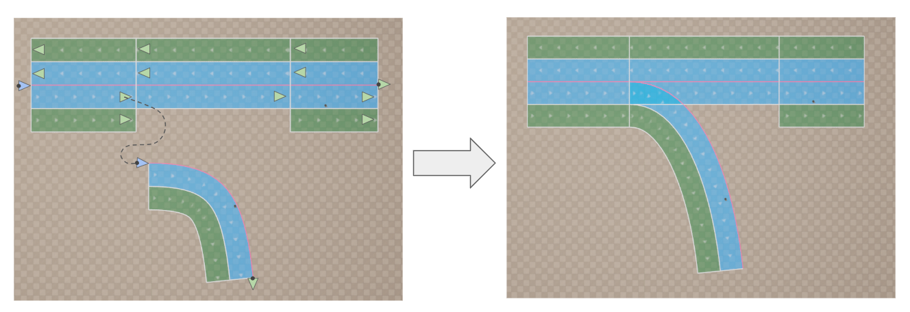

These two rules are sufficient to model any intersections or interchanges, even the most complex ones.  
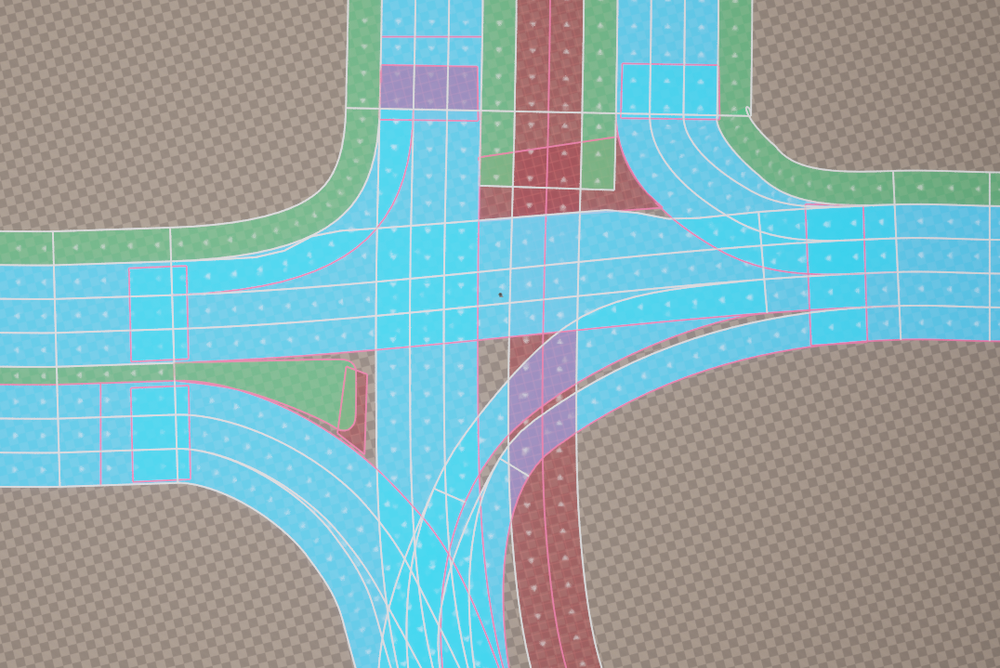  

