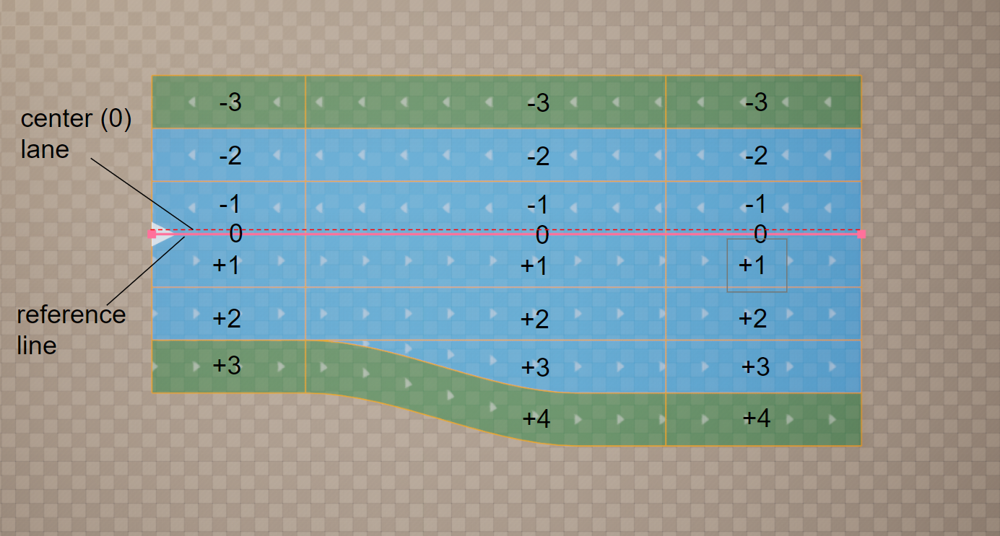
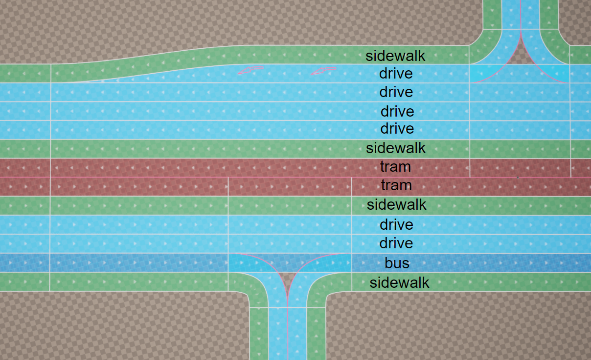
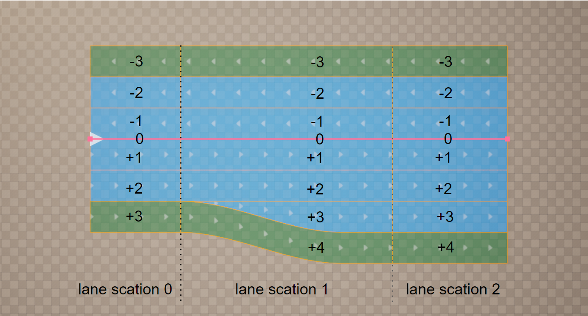
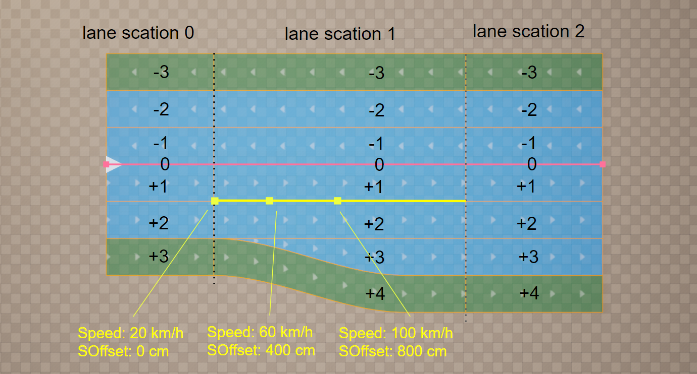
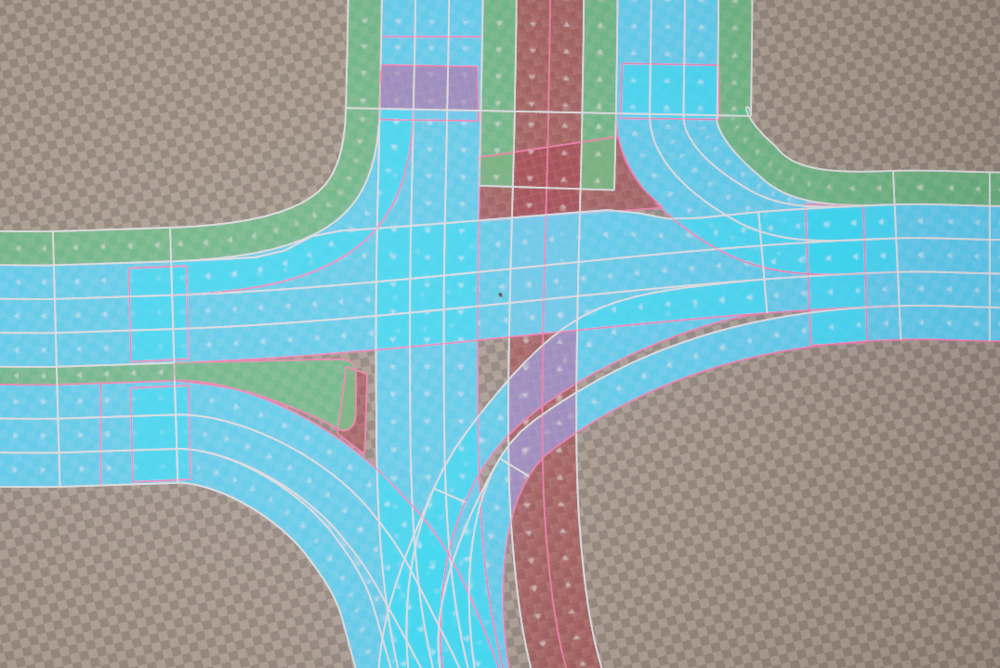

# Road Model
В основе моедли дорожной сети и всего плагина UnrealDrive лежит актор компонент URoadSplineComponent.
URoadSplineComponent - это единственный и достаточный компонент, с помощью которого представляется граф дорожных сетей. Хотя сам компонент описывает всего лишь один простой участок дороги, комбинация URoadSplineComponents способна описать даже очень сложную дорожную сеть, развязки и перексрестки. 
Тем, кто знаком со спецификацмей [ASM OpenDrive](https://www.asam.net/standards/detail/opendrive/), все идеи, реализованные в URoadSplineComponent, покажутся очень знакомыми. Действительно UnrealDrive подчеркнул очень многое из это спнцификации.  
Если кратко описать что такое URoadSplineComponent - это сплайн, который включает в себя информацию о road lanes в доль этого сплайна.

## Basic concepts and theses
  * Разработка дорожной сети всегда состоит из вдух этапов - моделирование графа дорог и процедурная генераци на основе построенных графов.
  * Любой объет графа на сцене - это произвольный AActor, который включает в себя один или несколько URoadSplineComponent компонента.
  * URoadSplineComponent - простой участок графа (или дороги)
  * Любая дорога или развязка строится из одноги или несколько URoadSplineComponent. При том, одна дороги, как правило, состоит из одно URoadSplineComponent, а перекрестки или развязки - из несколькких.
  * При моделировании графов стоит помнить, что, в процессе процедурной генерации, мешь дорожной сети разбивается на секции по принцепу "один AActor - одна секция". Это означает что одина актор не должен содержать больший площади дорожных сетей, иначе на выходе будет генерироваться большой mesh, который может не очень отпимально оброабатывать render и физическим пйплайном UE. В будующех релизах это ограничение возможно будет снято. Исключения - это AActor который состоят только из одного URoadSplineComponent - они могут автоматически разбиваться на несолько static meshes.

## Road Reference Line
URoadSplineComponent - отнаследован от USplineComponent, .т.е. он обладает всеми свойствами базового сплайна. И этот базовый сплайна и является опроной линией, в долько которой и генериуется дорога.
Опорная линия обозначается розовым цветом. It is a left-handed coordinate system. The S-axis (or S-Offset in UI) follows the tangent of the road reference line. The R-axis (R-Offset in UI) is orthogonal to the S-axis and may be rotated around the S-axis by superelevation. The left-handed coordinate system is completed by defining the up-direction H orthogonal to S-axis and R-axis.  


## Road Lanes
Lanes are an essential part of all roads. Lanes are attached to the road reference line of the road and are defined from inside to outside. A minimum road definition requires a center lane and an additional lane with a defined width. The number of lanes per road is not limited.
The center lane has no width and serves as reference for lane numbering. The center lane itself has the lane index 0. The numbering of the other lanes starts at the center lane: Lane numbers descend to the right, meaning a positive  R-direction, and ascend to the left, meaning a negative R-direction.

This figure shows the center lane for a road with multiple traffic lanes and different driving directions. In this case, the center lane separates the driving directions, depending on left- and right-hand traffic, specified in Road type. Because no lane offset is used, the center lane is identical to the road reference line.

### Lane Types
The lane type is defined per lane. A lane type defines the main purpose of a lane and its corresponding traffic rules. Есть базовые типы, такие как (driving, shoulder, border, biking, etc), но польхователь таже может добавить собственные и описать лигику повежения для них.
  

### Lane Direction
Каждая полоса дороги всегда имеет направление и это напраление также является направлением дважения для машин. На графах это направление всегда показано белыми стрелками для каждой полосы. This direction is specified by a combination of different elements and attributes, в том числе для любой отдельной линии можно всегда поменять направление движения. Детально как это сделать будет рассказано в слудующих пунктах.  
  
На данной фигуре показано что линия с индексом -1 имеет инвертирование направление.

### Lane Groups
For easier navigation through road description, the lanes within a lane section are grouped into left, center, and right lanes.


### Lane Sections
Lanes may be split into multiple lane sections. Each lane section contains a **fixed number of lanes**.  
  
This figure shows that every time the number of lanes changes, a new lane section is required. Lane sections are defined in ascending order along the road reference line.  

  
This figure shows how lane sections for complex roads may be defined for one side of the road only - left, right and both sides

### Lane Offset
A lane offset may be used to shift the center lane away from the road reference line. This makes it easier to model local lateral shifts of lanes on roads, for example for left turn lanes.  
A combination of lane offset and shape definition can lead to inconsistencies depending on the interpolation used for the lane offset. Because linear interpolation is used for the road shape along the road reference line, linear interpolation should also be used for the offset definition to enable consistent combined use of both definitions.  
  
This figure shows the offset of the center lane away from the road reference line.

### Lane Attributes
Lane attributes это произвольные методанные, которы могут быть закреплены вдоль **Road Lane**.  
Это один из самых мощных инструментов по кастомизации и добавления новых возможностей в плагин UnrealDrive. Пользователь может зарегистрировать и определять поведение любого количества атрибутов. Аттрабиты могут быть использованы для кастомизации процедурной генерации (например, для обозначены участки неровной дороги), для определения приоритетов движения и ограничение скокрости (например, для генерации дорожного трафика), генерации spline mesh (например, генерация ограждений вдоль полосы или растительности) и другое. 
По умолчанию, доступо два типа атрибутов - speed limit и дорожныая разметка.  
Атрибут обладает следующими свойствами:
  - Уникальное имя (например: speed, mark, fence)
  - Для 
  - Атрибут добалятся на **Road Lane** и распространяется на всю полосу.
  - Атрибут может содержать произвольные данные. Данные - это произвольная С++ или BP структура.
  - Атрибут всегда имеет один или несолько **Attribute Key**. 
  - **Attribute Key** - это данные Атрибут, который могут меняться на протяжении всей **Road Lane**.  
  - Атрибут всегда имеет минимум один **Attribute Key**, который всегда расположен в начале **Road Lane**.  

  
Данная фигура показывает визуализацию атрибута - **Speed**. В этом примере только одна **Road Lane** с ID ```+1``` в **RoadSection** ```1```  имеет Атрибут **Speed**.  Данный Атрибут устанавливает скокрость движения трафика на **Road Lane** и в данном примере имеет 3 ключа с координатами SOffset: 0cm, 400cm, 800см. Ключь содержит только одно поле данных ```speed``` типа - число с плвающей точкой. Это три ключа имют соотвествующие данные: 20km/h,  60km/h, 100km/h. 

## Intersections and Junctions
В UnrealDrive нет специальных типов или классов, которые могли бы отвечать за функцию создания перекрестков или развязок. В место этого, UnrealDrive предлагает возможнсть линковать несколько сплайнов между собой. В свою очередь группа залинкованных сплайнов моежт представлять собой перекресток или развязку ественным образом.  

Как уже было сказано, у каждой road lane есть направление. В доль этого направлению, в начале и конец есть *Lane Predecessor Connection* и *Lane Successor Connection* сооотвественно. 
Так же у каждого сплайна URoadSplineComponent то же есть направление, начало и конец. Эти начало конец являются *Road Predecessor Connection* и *Road Successor Connection*.  
  

Два правила линковки:
  * *Road Successor Connection* -> *Lane Predecessor Connection* (связь один ко многим)  
     
  * *Road Predecessor  Connection* -> *Lane SuccessorConnection* (связь один ко многим)  
    

Этих двух правил достаточто чтобы замоделировать любой перекресток или развязку, даже самый сложные.  
  

Главное правило, о котором стоит помнить при построении развязки или перексрестка:  
**Группа URoadSplineComponent, представляющая собой перекресток или развзяку, должна находиться внутри одного AActor**. Это необходимо лишь для того, что бы корректно выполнялась процедурная генерация, так как процедурная разбитые дорожную сеть на много static meshes, по принцепу принадлежности к AActor (см TODO) 

