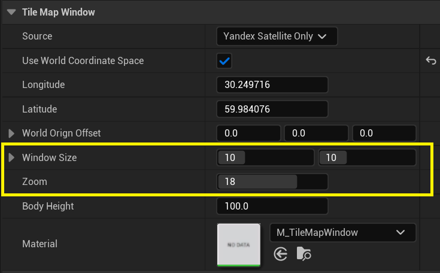
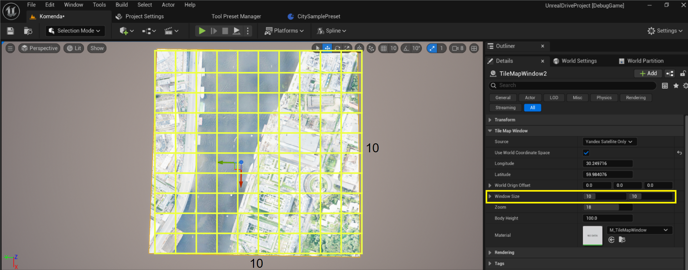
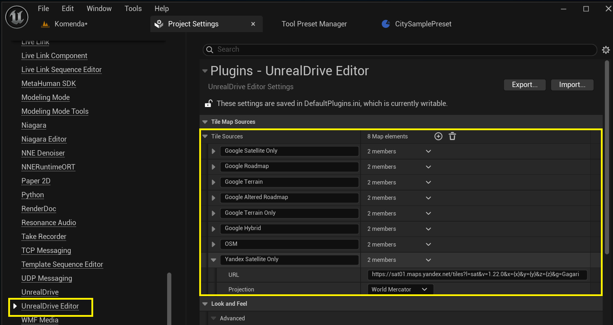

# Tile Window

**Tile Window** - это Actor, который позволяет рендерить открытые растровые карты, такие как Google Map, OSM, Bind и др., для целей использования их в качестве паттерна в UrealEngine Editor, для создания цифровых двойников территорий реального мира.  
Для начала использования, достаточно просто разместить **Tile Windows** актор на сцену:  
  

## Система координат
Достаточно задать ```Longatude``` и ```Latitude``` **Tile Window** мгновенно перерендерит область окна:  
  

Параметр ```Use World Coorfinate Space``` определяет начала координа для ```Longatude``` и ```Latitude``` в мире Unreal Engine:
  - Если флаг не установлен, то за начала координат берутся координаты **Tile Window** Актора
  - Если флаг установлен, то за начало координат берется точка (0, 0)  мира Unreal Engine. В этом случае при изменении координат **Tile Window** Актора, будет автоматически пересчитана область окна **Tile Window** согласно новым кооодинатам. Обычно такой режим удобнее использовать для восоздании больших участков территрий земли. Так как в этом случа  **Tile Window** работает как "окно" в реальный мир, и при его перемещении будет автоматически отображен новый участок карты:  
    

## Размеры окна:
Для изменения размера и разрешения окна используется два парамсетра ```Window Size``` и ```Zoom```:  
    
  - ```Zoom``` - Map tile zoom levels determine the level of detail and the number of tiles displayed by dividing the world into a grid of square tiles at each zoom level, more details [here](https://wiki.openstreetmap.org/wiki/Zoom_levels). Оптимальный уровень zoom - не меньше 18. Редко какие tile sources поддерживают zoom больше 22.

  - ```Window Size``` - определяет количество тайлов (по горизонтале и вертикале), которое следуют отрендерить. Не стоит здесь указывать слишком большие значения, воизбеженгия переполнения видео памяти:
    

## Источники карт
По умолчанию **Tile Window** поддерживает Google, OSM и Ynadex карты. Достаточно просто сменить ```Source```:  
  
Так же есть возможность добавить собственные источники, для этого необходимо зайти в **Edit -> Project Settings -> Unreal Drive Editor** и добавить новый источник в ```Tile Sources```:  
  
```URL``` источника это произвольный URL адрес формата ```https://sample.map.source.com/{x}/{y}{z}```, где ```{x}```, ```{y}```, ```{z}``` будут заменени на x, y, z координаты тайлов во время рендеринга.


