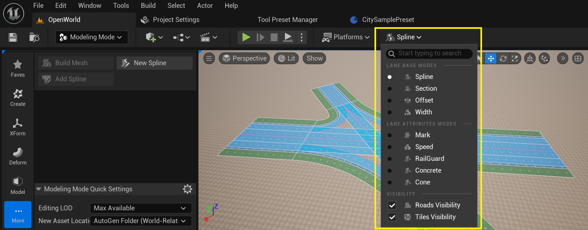
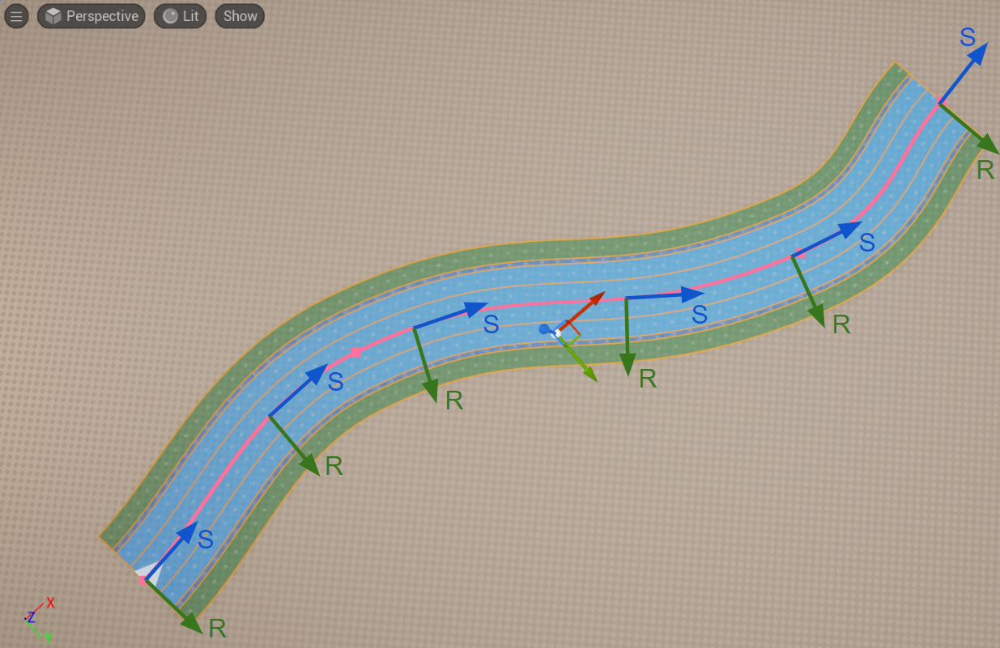
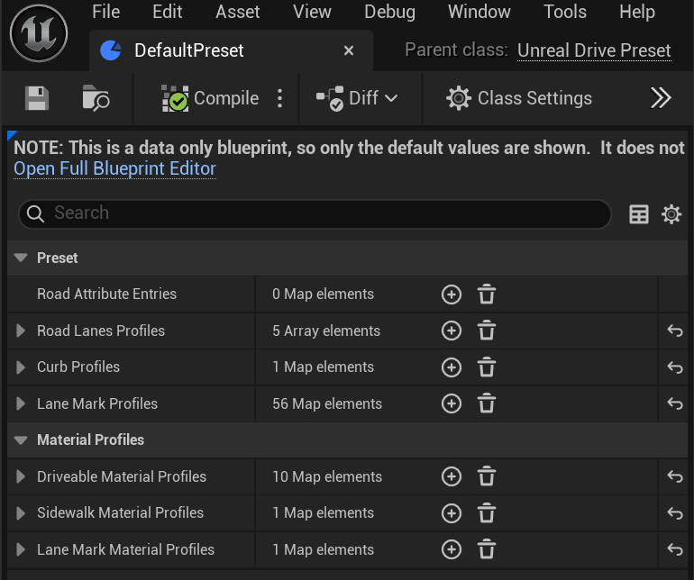

# User Interface Overview
After installing the plugin, new user interface elements become available in UnrealEngine, along with new classes:
  * Road [Road Editing Modes](EditorModes.md) - allows to switch between **URoadSplineComponent** editing modes to edit spline properties described in [Road Model](RoadModel.md):  
      
     
  * **Road Modeling Toolset** provides tools for [drawing new splines](DrawTool.md) and [generating assets](ProcedureGenerationTool.md):  
      
     
  * Two ActorComponents:
    * **URoadSplineComponent** - a basic component that is an elementary element of the road network and implements the concepts of the [Road Model](RoadModel.md)  
        
       
    * [UTileMapWindowComponent](TileWindow.md) - allows to render open raster geo-maps, such as Google Map, OSM, Bind, etc.  
        
       
  * [Presets](Presets.md) - a powerful tool that allows to save, reuse, and distribute profiles of various entities used in UnrealDrive, such as [procedural generation](ProcedureGenerationTool.md) profiles, [Lane Attributes](RoadModel.md#lane-attributes) profiles, and profiles for [drawing tools](DrawTool.md):  
      

