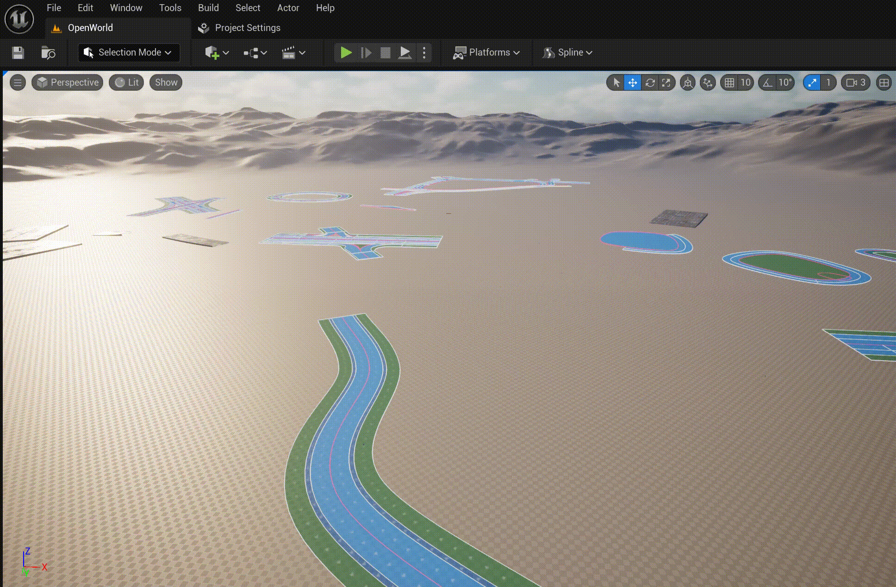

# User Interfca

## Overview
После установки плгина, становятся доступны два новых элемента пользовательского интерфеса UnrealEngine:
  * Road Modeling Mode  
     
  * Меню режима рисования  
     

А также два ActoComponents:
  * URoadSplineComponent
  * UTileMapWindowComponent

Далее о обо всем подробнее.

## Modeling Tools

### New Spline & Add Spline
Для более удобного рисования сплайнов URoadSplineComponent разработано два Modeling Tools: **New Spline** и **Add Spline**. Эти два режима абсолютно одинаковые, отличнаются лишь тем, что в первлм случаем создает  новый AActor и к нему добавлятся новый URoadSplineComponent, во стором случаем добавляется новый URoadSplineComponent к выделленому актору, который уже имеет как минимум один URoadSplineComponent (т.е. для второго случая актор со спланами должен быть выделен).
  

Начать рисование сплайна можно с *Lane Successor Connection*:  
  

А закончить на *Lane Predecessor Connection*:  
  

#### Lane Source
The **Lanes Sorce** defines the rules for detection of road lanes profile (num and types of the road lanes) for spline drawing.  
  
There are next options:
  - **One Lane** - Copy only one road lane from the *Lane Successor Connection*. Only valid if the spline is drawn from the *Lane Successor Connection*.
      
	- **Right Side** - Copy the road lanes from the *Lane Successor Connection* to the last right lane in the source road section. Only valid if the spline is drawn from  the *Lane Successor Connection*.
      
	- **Both Sides** -  Copy all road lanes from the *Lane Successor Connection*. Only valid if the spline is drawn from  the *Lane Successor Connection*. 
      
	- **Road Profile** - Copy road lanes from the profile.
      

### Buld Mesh
Этот режим позволят генерировать ассеты (static meshes, dynamic meshes и spline mesh) для одного или несольких выделенных актовров, содержажих URoadSplineComponent. Отдельной генерит ассеты для:
  - Drive Surface
  - Decales (генерятся только для Drive Surface Lanes)
  - Sidewolks
  - Curbs
  - Marks
  - Attributes
Для каждого из этих типов ассетов есть сотвествующия группа параметров.

#### Mesh Materials
Для каждого типа типа генерируемого ассета есть (Drive Surface, Sidewolks, Curbs и т.д) есть параметр **Material**. Он позволяет подмеить матриал из профайла матриалов.

#### Mesh UVs
Процедурная генерация для Road Surface генерирует два уровня тектурных координат:

  - UV0 - отдельный трек для каждой полосы. Его удобно использовать для отображения, например, дорожный колии или драмвайных путей.
  - UV1 - трек для левой и правой частей дороги. Его удобно использовать для отображения, например, заплаток на дороге или ям.

Для отображения дебажных материалов как на картинке выше, необходмо в меню **Project Settings -> Plugins -> Interactive Tool Presets** добавить **UnrealDriveInterectiveToolsPreset** в **Loadad Preset Collection**. После чего два пресета **UV0 Debug** и **UV1 Debug** станут доступны в сохраненных престах.  

#### Mesh Vertex Color
В метериалах для дорожной поверхности предлагается использовать атрибут Vertex Color для обозначения областей mesh, где присутсвуют лужи, дорожная колея и другие детали, которые необходимо контролировать на швах и пересечениях дорожных полос. Это позволит устранять артефакты генерации на швах и улучшать общий вид дорог.   

Для параметризации Vertex Color для Drive Surfaсe предлагаются следующие параметры:  
  
Они сгенерировать цвет вршин в центре м на краях меша, а так же в зрнах пересения полос:  
  
Но для сложных перекретскеов, вам, скорее всего, придется "дораскарасить" необходмые вершины вручную в режиме Mesh Paint, как это было показано выше. В будующих релизах UnrealDrive возможно удасть усовершенствовать механизм генерации цвета вершин, что бы не приходилось обращаться к режиму MeshPaint

## Принцип группировки сплайнов
> [!IMPORTANT]
> Важно понимать, что процедурная генерация дорог, воспринимает каждого актора (содержащего хотябы один URoadSplineComponent) как отдельную единицу генерации, не связанную с другими акторами и сплайнами на сцене.
Отсюда следует два правила:
  - Группа URoadSplineComponent, представляющая собой перекресток или развзяку, должна находиться внутри одного AActor.
  - Не следует в одного актора помещать слишком большие участки дорожной сети, в противном случае будут сгенерены большие static meshes, и сними UnrealEngine не эффективно работает в вопросах оптимизации рендеринга и физики.

Примеры:  
  - В этом пример четыре URoadSplineComponent компонента (SplineA_1, SplineA_2, SplineA_3, SplineA_3) находятся в одном акторе (ActorA), и соотвественно процедурная генерация для актора ActorA примит во внимание все три сплайна, и правильно сгенерирует перекресток.  
  
  - В этом примере уже два актора (ActorA и ActorB), включающие в себя по два компонента (SplineA_1, SplineA_2, SplineB_1, SplineB_2)
    
  Так происходит потому-что сплайны SplineA_1 + SplineA_2 и SplineB_1 + SplineB_2 триангулируются отдельно, и получится следующий результат:  
    
  - Этот пример показывает, как следует разбивать дорожную сеть на акторы, по принцепу, каждый перекресток/развязка помещен в отдельный актор.  
    

Именно поэтому, для удобства, введено два режима рисования сплайнов **New Spline** и **Add Spline** - это позволяет или добавлять новый сплайн в актор, или создавть новый актор со спланом внутри.

## Preset

### Add Road Draw Profile

## Tile Window
