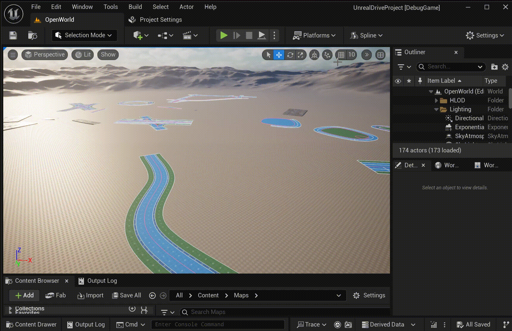
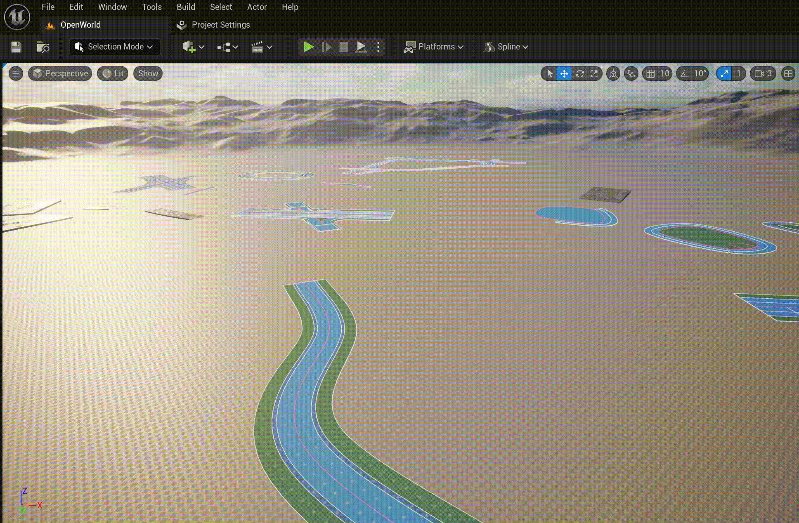

# User Interfca Overview

После установки плгина, становятся доступны два новых элемента пользовательского интерфеса UnrealEngine:
  * Road Modeling Mode  
     
  * Меню режима рисования  
     

ActoComponents:
  * URoadSplineComponent
  * UTileMapWindowComponent

Пресеты (UUnrealDrivePreset)

