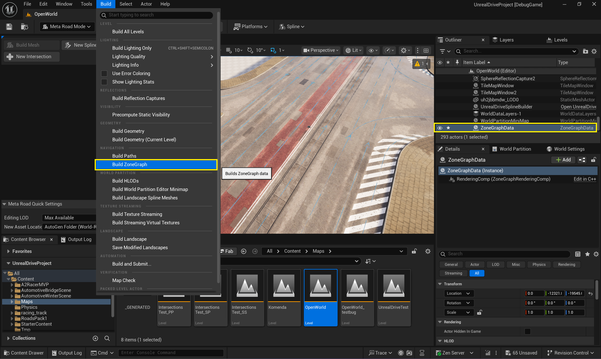
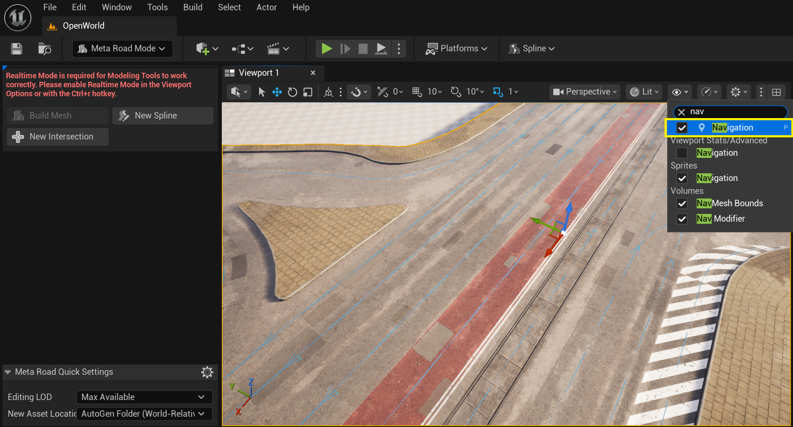
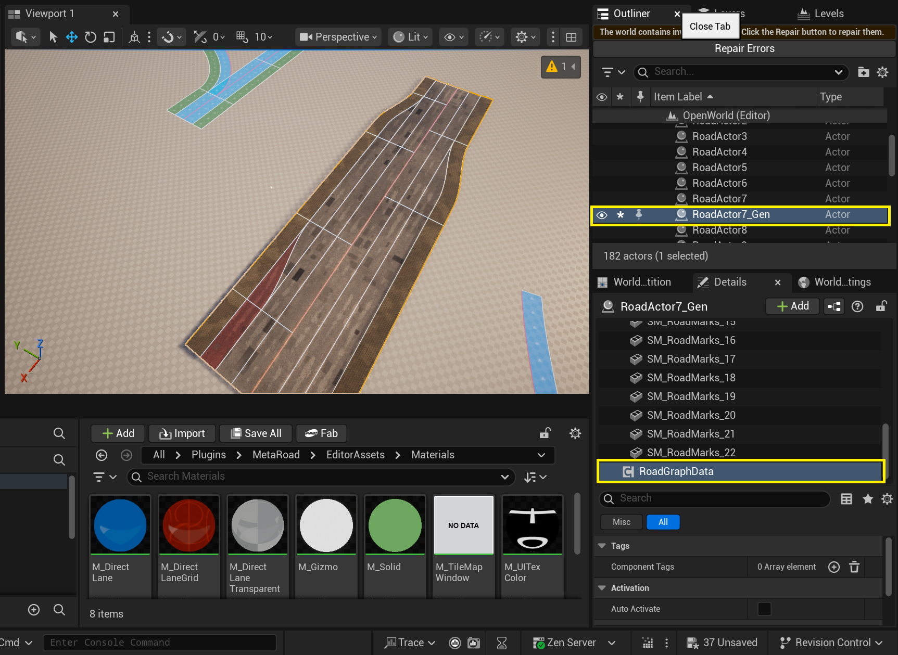
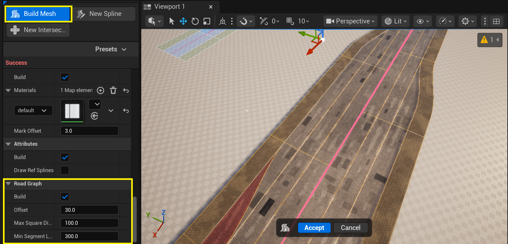
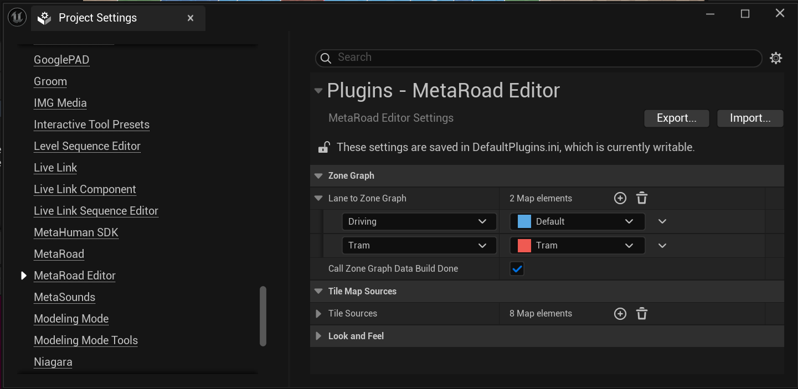
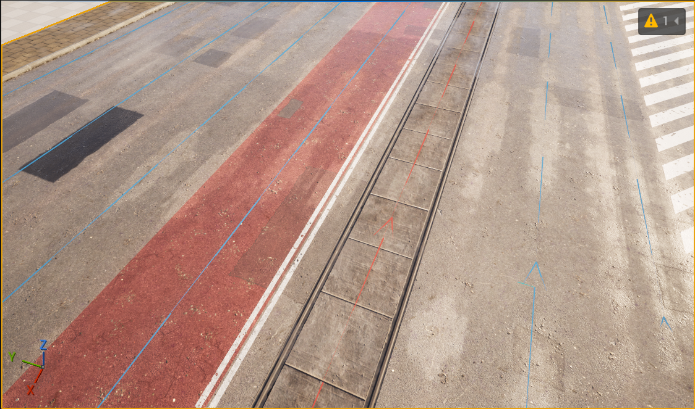

# Zone Graph (Pro)

Билдниг **ZoneGraphData** происходит через меню **Build->Build ZoneGraph**, так же как и в [стандартном подходе для ZoneShape](https://dev.epicgames.com/community/learning/tutorials/qz6r/unreal-engine-zonegraph-quick-start-guide). В результате чего будет сгенерировано по одному **ZoneGraphData** актору для каждого левела, который будет содержать навигационные данные для соотвествующего левела:  
  

Визуализация построенных **ZoneGraphData** удобно посмотреть, активировав флаг **Navigation**:  
  

**ZoneGraphData** не не билдится для **URoadSplineComponent**. Билдниг **ZoneGraphData** будет происходить только для тех акторов, у которых есть компонент **URoadGraphDataComponent**. :  
  

**URoadGraphDataComponent** генерируется в момент генерации меша (см. [Build Mesh Modeling Tool](ProcedureGenerationTool.md)) и содержит даные необходимы для генерации графов дорог (включая ZoneGraph):  
  

В **Edit -> Project Settings -> MetaRoad Editor** можно указать соотвесте **Road Lane Types** и **Zone Graph Tags** для того чтобы выбрать для каких типов дорожных полос необходимо генерировать **ZoneGraphData**:
  

В примере ниже показано, что для трамвайной полосы был сгенерирован участок ZoneGraph с Tag = Tram:
  

